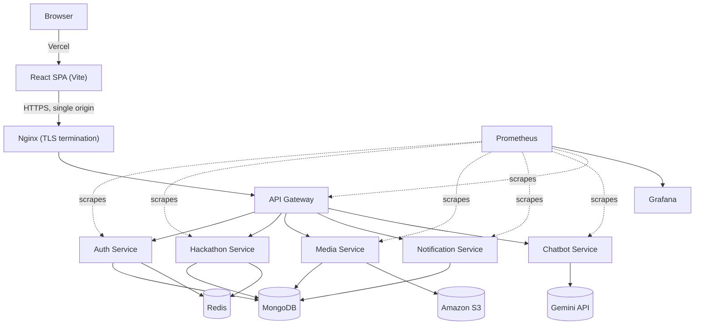

<p align="center">
  
</p>

<h1 align="center">HackSprint</h1>
<h3 align="center">A Distributed Hackathon Platform</h3>

<p align="center">
  Built at IIT Jodhpur — students discover and register for hackathons, form teams,
  submit projects, and get judged; organizers run events end-to-end from creation to results.
</p>

---

## 1. What This Is

HackSprint is a hackathon-hosting platform with two sides: **students** browse and register for hackathons (solo or in a team formed via a shareable invite code), submit their project (GitHub repo, live demo, documents) within a fixed window, and see results on a public leaderboard. **Admins/organizers** create and configure hackathons (subject to platform-admin approval), assign judges, review submissions, and score them. Both sides get email, in-app, and browser push notifications for things like deadline reminders and team activity.

Alongside that original submission-based format, HackSprint also supports **on-spot events** — in-person, bracket/tournament-style competitions (drone combat, robotics, similar physical competitions) with no project submission at all. Admins pair teams into matches round by round and enter scores live; standings update automatically and are always publicly visible, and teams get reminded (in-app, email, and push) as their scheduled match time approaches.

It's deliberately built as a **distributed system** rather than a single monolith — five independently deployable backend services behind one API gateway, a separately deployed frontend, containerized with Docker, monitored with Prometheus/Grafana, and shipped via GitHub Actions. Part of the point of this project is the engineering exercise of building and operating that kind of system, not just the product on top of it.

---

## 2. Architecture



The frontend and backend deploy independently: the frontend is a static build hosted on **Vercel**, the backend runs as a set of Docker containers on a single **AWS EC2** instance behind Nginx, shipped by **GitHub Actions** on every push to `main`. Neither side knows or cares how the other is hosted — they only agree on the API Gateway's public URL.

This is the 60-second version. The full architectural reasoning — why microservices, the request-flow sequence, data-layer choices, and known tradeoffs — is in [`backend/docs/architecture.md`](backend/docs/architecture.md).

---

## 3. Repository Structure

```
HackSprint
├── backend/
│   ├── api-gateway/          Single public entry point — routing, CORS, rate limiting
│   ├── auth-service/         Auth, Google OAuth, JWT + refresh tokens, profiles
│   ├── hackathon-service/    Hackathons (submission-based + on-spot/bracket), registrations, teams, judging, discussions
│   ├── media-service/        File uploads → Amazon S3
│   ├── notification-service/ In-app notifications + transactional email + browser push (BullMQ)
│   ├── chatbot-service/      FAQ chatbot (Google Gemini) — stateless, no database, no user data access
│   ├── nginx/                Reverse proxy + HTTPS termination config
│   ├── prometheus/           Scrape config
│   ├── grafana/              Provisioned datasource + dashboard
│   ├── docker-compose.prod.yml
│   └── docs/                 Detailed architecture, services, API gateway, and CI/CD docs
└── frontend/
    └── hack-sprint/          React + Vite SPA — see its own README for frontend-specific detail
```

---

## 4. Tech Stack

| Layer | Technology |
|---|---|
| Frontend | React 19, Vite, Tailwind CSS, TanStack Query, Zustand, React Router |
| Backend | Node.js + Express, one process per service |
| Database | MongoDB (primary), Redis (caching) |
| File Storage | Amazon S3 (IAM role–based access, no static credentials) |
| Auth | Google OAuth + JWT access/refresh tokens (student and admin sessions are independent) |
| Async work | BullMQ/Redis (transactional email, browser push), `node-cron` (deadline + on-spot match reminders) |
| AI | Google Gemini API — scoped to a stateless platform-FAQ chatbot, no access to user accounts/data |
| Reverse proxy | Nginx (HTTPS via Let's Encrypt) |
| Containerization | Docker + Docker Compose |
| CI/CD | GitHub Actions (backend → EC2), Vercel (frontend) |
| Observability | Prometheus + Grafana |

---

## 5. Local Development

**Backend** (from `backend/`):
```bash
cp <service>/.env.example <service>/.env   # per service, see backend/docs/services.md
docker compose up -d --build
```
Each service needs its own env file (Mongo/Redis connection strings, JWT secret, Google OAuth credentials, S3 credentials for `media-service`, Brevo API key and VAPID (Web Push) keys for `notification-service`, etc.) — the exact requirements are enforced in each service's own startup validation, not duplicated here. See [`backend/docs/services.md`](backend/docs/services.md) for what each service owns.

**Frontend** (from `frontend/hack-sprint/`):
```bash
npm install
npm run dev
```
Requires `VITE_API_URL` pointing at your local gateway (`http://localhost:5000` by default) — see [`frontend/hack-sprint/README.md`](frontend/hack-sprint/README.md) and its `.env.example`.

---

## 6. Documentation

This README is the entry point. Everything below goes deeper on one specific part of the system:

| Doc | Covers |
|---|---|
| [`backend/docs/architecture.md`](backend/docs/architecture.md) | Full system architecture, request flow, data layer, tradeoffs, planned work |
| [`backend/docs/services.md`](backend/docs/services.md) | What each of the five services owns and is responsible for |
| [`backend/docs/api-gateway.md`](backend/docs/api-gateway.md) | Gateway routing, middleware chain, current limitations |
| [`backend/docs/observability.md`](backend/docs/observability.md) | Deployment, CI/CD pipeline, Prometheus/Grafana access |
| [`frontend/hack-sprint/README.md`](frontend/hack-sprint/README.md) | Frontend folder structure, routing, API client, state management, Docker |

---

## 7. Contributing

```bash
git clone https://github.com/devlup-labs/HackSprint.git
cd HackSprint
git checkout -b feature/my-feature
# make changes
git commit -m "Add my feature"
git push origin feature/my-feature
```

Open a pull request against `main`. If you're touching backend routing, data ownership, or infrastructure, check the relevant doc in `backend/docs/` first — several design decisions there are deliberate tradeoffs, not oversights.

---

## 8. License

See [`LICENSE`](LICENSE).

<p align="center">HackSprint · DevLup Labs · IIT Jodhpur</p>
