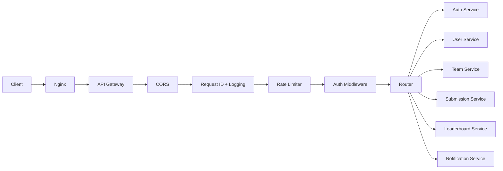
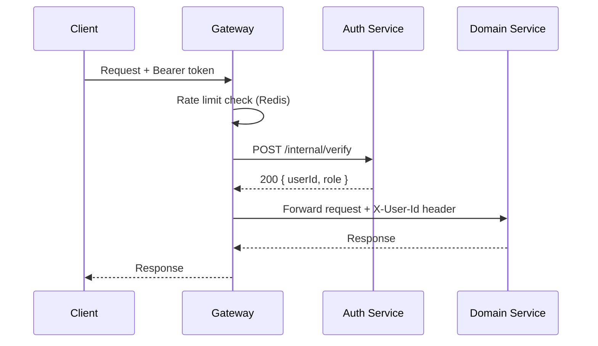

# API Gateway

## Overview

The API Gateway (`api-gateway`, port `5000`) is the single entry point for every client request. It is a thin Express application with no business logic and no database of its own its job is routing, authentication, rate limiting, and observability at the edge, so that every domain service can assume requests reaching it are already authenticated.

## Purpose

Centralize the concerns that would otherwise be duplicated in every service: verifying JWTs, enforcing rate limits, logging, and CORS. This keeps domain services focused purely on business logic.

## Architecture



## Routing

Routing is prefix-based, defined in a single `routes.ts` table mapping URL prefix → target service:

```typescript
export const routeTable: Record<string, string> = {
  "/api/auth":         "http://auth-service:5001",
  "/api/users":         "http://user-service:5002",
  "/api/teams":         "http://team-service:5003",
  "/api/submissions":   "http://submission-service:4004",
  "/api/leaderboard":   "http://leaderboard-service:4005",
};
```

Note the Notification Service is deliberately absent from the public route table — it has no client-facing API and is reachable only for internal health/metrics scraping.

## Proxying

Proxying uses `http-proxy-middleware`, configured per route with `changeOrigin: true` and a `pathRewrite` that strips nothing — downstream services receive the full `/api/...` path so their own route definitions stay consistent with what's documented publicly. The gateway forwards the `X-Request-Id` and `X-User-Id` (set by the auth middleware) headers on every proxied call.

```typescript
app.use("/api/submissions", createProxyMiddleware({
  target: routeTable["/api/submissions"],
  changeOrigin: true,
  onProxyReq: (proxyReq, req) => {
    proxyReq.setHeader("X-Request-Id", req.requestId);
    proxyReq.setHeader("X-User-Id", req.user?.id ?? "");
  },
}));
```

## Authentication

Every request to a path other than `/api/auth/register`, `/api/auth/login`, and `/health` must carry a `Bearer` JWT. The auth middleware calls the Auth Service's internal `POST /internal/verify` endpoint, attaches the returned claims to `req.user`, and rejects with `401` on failure. This is a synchronous network call on every authenticated request — a deliberate tradeoff (see Tradeoffs below) chosen for correctness over the current scale's latency cost.

## Request Flow



## Middleware

Applied in order: CORS → request ID generation + structured logging → Redis-backed rate limiter (see [`redis.md`](./redis.md#rate-limiting)) → auth verification → route-specific authorization (role checks, e.g., only `judge` role may call `/api/leaderboard/scores`) → proxy.

## Metrics

The gateway exposes `GET /metrics` in Prometheus format via `prom-client`, including: `http_requests_total{route,method,status}`, `http_request_duration_seconds` (histogram), and `rate_limit_rejections_total`. See [`prometheus.md`](./prometheus.md) for scrape configuration and [`grafana.md`](./grafana.md) for the dashboard built on these metrics.

## Error Handling

A centralized error-handling middleware catches all errors (thrown, rejected promises, or proxy connection failures) and normalizes them to a consistent JSON shape:

```json
{ "error": { "code": "SERVICE_UNAVAILABLE", "message": "..." , "requestId": "..." } }
```

If a downstream service is unreachable (connection refused/timeout), the proxy middleware's `onError` handler returns `502 Bad Gateway` with `code: SERVICE_UNAVAILABLE` rather than letting the connection hang — bounded by a 10-second per-request timeout on all proxied calls.

## Advantages

- Single place to change cross-cutting concerns (auth, rate limiting, CORS) without touching six services.
- Domain services can be simpler and trust their inputs are pre-authenticated.
- One place to observe aggregate traffic and error rates.

## Tradeoffs

- **Single point of failure:** if the gateway is down, the entire API is down, even if every domain service is healthy. Mitigated today by Docker's automatic restart policy and, at larger scale, by running multiple gateway replicas behind Nginx (see [Future Scaling Strategy](./architecture.md#future-scaling-strategy)).
- **Extra network hop and latency** on every request (client → Nginx → Gateway → Service, plus a synchronous Auth Service call). Acceptable at current traffic; a future optimization is caching verified JWT claims briefly in the gateway's memory or Redis to avoid the extra hop on every single request within a token's lifetime.
- **Coupling on the route table:** adding a new service requires a gateway deployment, not just a service deployment. Accepted as a small cost for centralized control.

## References

- [`services.md`](./services.md) — services the gateway routes to
- [`redis.md`](./redis.md) — rate limiting implementation
- [`security.md`](./security.md) — authentication and authorization details