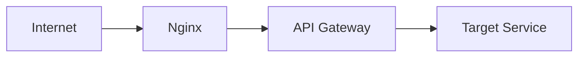
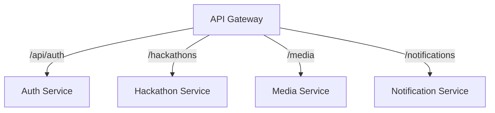
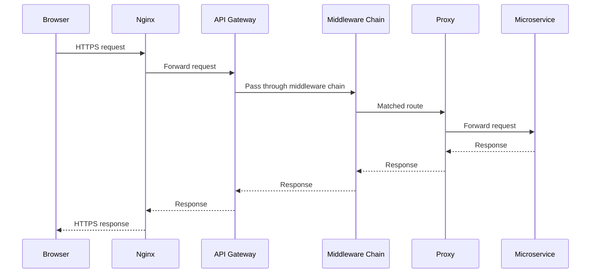

# HackSprint — API Gateway

**Status:** Living document
**Scope:** API Gateway service
**Audience:** Engineers contributing to or operating HackSprint

See also: [`architecture.md`](./architecture.md) for how the gateway fits into the platform as a whole.

---

## 1. Overview

The API Gateway is the single public entry point for every backend request in HackSprint. Clients never communicate directly with internal microservices — every request, regardless of which service it's ultimately destined for, enters through the same path.



The gateway is intentionally lightweight. It contains no business logic, and it owns no database. Its job is limited to request routing and a small set of cross-cutting infrastructure concerns — logging, metrics, security headers, and the like — that would otherwise have to be duplicated in every downstream service. This is a narrow mandate by design: the more a gateway takes on, the more it becomes a shared point of coupling and risk for every service behind it, so HackSprint keeps it deliberately thin.

---

## 2. Current Responsibilities

The gateway currently performs routing, CORS handling, security headers via Helmet, response compression, request logging via Morgan, request ID generation, Prometheus metrics exposure, reverse proxying via `http-proxy-middleware`, and a health endpoint.

It is equally important to be explicit about what the gateway does *not* do today. It does not validate JWTs, does not perform role-based access control, does not query MongoDB, contains no business logic, stores no data, and implements no rate limiting or caching, and it does not call Redis. Those responsibilities either live in downstream services already or are captured as planned work in Section 12. Anyone integrating with the gateway should treat this list as authoritative for what it does and does not guarantee today.

---

## 3. Project Structure

```
src/
  config/
  middlewares/
  metrics/
  routes/
    auth.proxy.js
    hackathon.proxy.js
    media.proxy.js
    notification.proxy.js
  index.js
```

`config/` holds the gateway's configuration — the values needed to know where each downstream service lives and how the process should start up. `middlewares/` contains the Express middleware the gateway applies to incoming requests, described in full in Section 5. `metrics/` contains the Prometheus instrumentation that backs the `/metrics` endpoint (Section 8). `routes/` contains one proxy file per downstream service — `auth.proxy.js`, `hackathon.proxy.js`, `media.proxy.js`, and `notification.proxy.js` — each responsible for forwarding requests under a specific URL prefix to its corresponding service. `index.js` is the application entrypoint: it wires the middleware stack, mounts the proxy routes, and starts the server.

This one-file-per-service layout keeps routing logic easy to navigate as services are added — adding a new downstream service means adding a new proxy file, not modifying a shared route table.

---

## 4. Routing

Routing is implemented as a set of individual proxy files, each bound to a specific URL prefix and forwarding matching requests to one downstream service.



Each proxy file owns exactly one prefix and knows nothing about the others. This keeps the routing logic for each service self-contained: understanding how `/media` requests are handled requires reading `media.proxy.js` and nothing else. There is no shared route table or central registry to keep in sync as the number of services grows.

---

## 5. Request Flow and Middleware

A request entering the gateway passes through a fixed middleware chain before it reaches a proxy and, ultimately, a downstream service.



The middleware chain runs in a fixed order:


Helmet runs first and sets a set of standard security-related HTTP headers, reducing exposure to a class of common web vulnerabilities before any other processing happens. CORS is applied next, controlling which origins are permitted to call the API — necessary because the gateway is the only component browsers talk to directly. Compression follows, reducing response payload size over the wire. JSON parsing then makes request bodies available to everything downstream of it. Morgan logs each request in a standard access-log format, giving a consistent record of gateway traffic independent of which service ultimately handled it. The request ID middleware runs next and is described in detail in Section 6. The metrics middleware then records request-level data for Prometheus (Section 7). Only after all of that does a request reach the proxy routes described in Section 4. Finally, the error middleware sits at the end of the chain, catching anything that was thrown or passed via `next(err)` earlier in the pipeline.

Placing Helmet, CORS, and compression before the proxy layer means every downstream service gets these protections for free without implementing them itself. Placing the error middleware last is standard Express practice — it is the only middleware in the chain that receives errors, and it must be registered after every other middleware and route to catch them.

---

## 6. Request ID

Every request that passes through the gateway is assigned a request identifier, attached to `req.requestId`. This identifier travels with the request through the rest of the middleware chain and is included in the logs produced further down the pipeline, which makes it possible to trace a single request across log lines even though the gateway is handling many requests concurrently.

This is a request identifier for correlating logs within the gateway's own request lifecycle — it is not a distributed tracing system, and no trace propagation to downstream services is implemented today. That capability is listed as future work in Section 12.

---

## 7. Prometheus Metrics

The gateway exposes a `GET /metrics` endpoint implemented using `prom-client`. Prometheus is configured to periodically scrape this endpoint, and the resulting metrics are visualized in Grafana. Because the gateway sits in front of every service, its metrics endpoint gives a single, consistent view of traffic volume and gateway-level behavior regardless of which downstream service a request is ultimately routed to.

---

## 8. Health Endpoint

The gateway exposes `GET /`, which returns the gateway's status, and `GET /metrics`, which serves the Prometheus metrics described in Section 7. These are the only two operational endpoints the gateway exposes outside of the service proxies themselves.

---

## 9. Error Handling

The gateway uses a single Express global error middleware, positioned as the last entry in the middleware chain (Section 5), to catch unhandled errors — including both proxy failures, where a downstream service is unreachable or returns an unexpected failure, and unexpected exceptions raised elsewhere in the request pipeline. There is no custom, per-error-type response shaping beyond this global handler; every error that reaches it is handled by the same catch-all path.

---

## 10. Current Limitations

Stated plainly: the gateway currently performs only routing and the cross-cutting concerns listed in Section 2. Authentication and authorization remain entirely inside downstream services — the gateway does not inspect or validate tokens. Rate limiting has not been implemented. The gateway itself is stateless, holding no session or request state between calls. All communication, both from Nginx to the gateway and from the gateway to downstream services, is synchronous HTTP.

---

## 11. Why a Gateway

Routing every request through a single gateway gives HackSprint one public endpoint to secure, monitor, and reason about, rather than four independently exposed services each needing its own perimeter. Cross-cutting middleware — security headers, CORS, compression, logging — is applied once, centrally, instead of being duplicated and potentially drifting across four separate Express applications. Because every downstream service is reached the same way, through a proxy file bound to a prefix, adding a new service is a small, well-contained change rather than a reconfiguration of the whole system — a simple form of service discovery appropriate to the current scale.

The gateway's position also matters for where the system is headed. Centralizing traffic through one layer today means that when authentication, rate limiting, or other cross-cutting concerns are added (Section 12), they can be added in one place rather than retrofitted into four services independently. Consistent request logging and request IDs across all traffic, regardless of destination service, is a direct consequence of that same centralization.

---

## 12. Future Improvements

The following are planned but **not implemented** in the current gateway. They are listed to make the intended direction explicit, and none of them should be read as part of the system described above.

- **JWT verification** — validating access tokens at the gateway so downstream services can trust an already-authenticated request rather than each verifying tokens independently.
- **Redis-backed rate limiting** — enforcing per-user or per-IP request limits using Redis.
- **Response caching** — caching gateway responses for cacheable requests.
- **Circuit breaker** — protecting the gateway and downstream services from cascading failure when a service is slow or unavailable.
- **Retry policies** — automatically retrying transient proxy failures under defined conditions.
- **API versioning** — supporting multiple concurrent API versions through the gateway.
- **Request validation** — validating request shape and content before proxying.
- **Distributed tracing** — extending the current request ID (Section 6) into full trace propagation across services.
- **Gateway authorization** — enforcing role-based access control at the gateway layer.
- **Load balancing across gateway replicas** — running multiple gateway instances behind a load balancer for redundancy and throughput.

---

## 13. Tradeoffs

Routing all traffic through a single gateway has clear advantages for a system at HackSprint's current scale. It keeps downstream services simpler, since none of them need to implement their own CORS, security headers, or compression. It centralizes infrastructure concerns in one codebase instead of four. It gives operational visibility — logs, request IDs, and metrics — from a single, consistent vantage point regardless of which service handled a request. And it provides a single routing layer, so the mapping from URL prefix to service lives in one place.

These advantages come with real costs. Every request now takes an extra network hop through the gateway before reaching its target service, adding latency that a direct client-to-service call wouldn't have. The gateway is also a potential bottleneck: because all traffic passes through it, its throughput sets an upper bound on the platform's throughput. And as the only public entry point, it is currently a single point of failure — if the gateway process goes down, the entire platform becomes unreachable, even if every downstream service is healthy.

These tradeoffs are acceptable at HackSprint's current scale. Traffic volume today does not come close to saturating a single gateway instance, so the extra hop and bottleneck risk are theoretical rather than observed problems. The single-point-of-failure risk is the same one already accepted at the infrastructure level by running everything on one EC2 host (see [`architecture.md`](./architecture.md)); addressing it meaningfully would require the load-balanced, multi-replica setup listed in Section 12, which isn't justified until the platform's traffic or availability requirements demand it.
