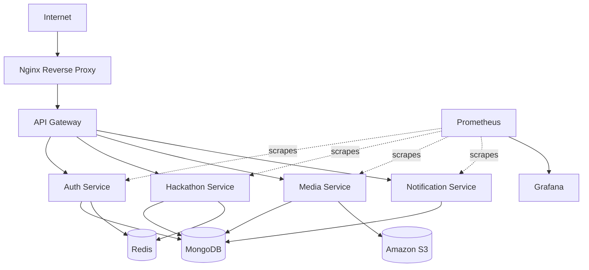
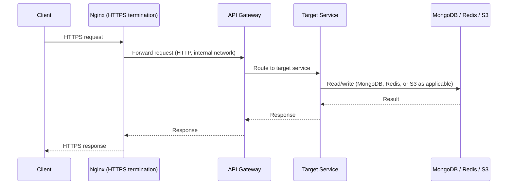
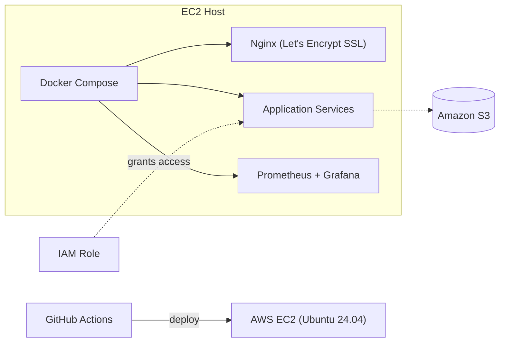
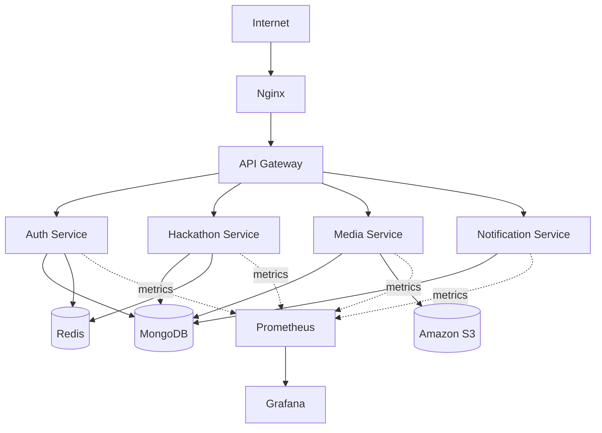

# HackSprint — System Architecture

**Status:** Living document
**Scope:** Backend platform architecture
**Audience:** Engineers contributing to or operating HackSprint

---

## 1. Overview

HackSprint is a centralized hackathon and developer learning platform built on a microservices architecture. It allows users to register and authenticate, browse and participate in hackathons, upload project submissions, receive notifications, and store media assets on Amazon S3.

Unlike a typical CRUD web application, HackSprint is deliberately structured as a backend-focused distributed system. The platform exists as much to be an engineering exercise as it does to be a product: it is a vehicle for building real experience with distributed systems design, inter-service communication, containerized deployment, observability, and cloud operations. That framing matters throughout this document — several architectural choices favor learning value and operational realism over the shortest path to a working feature.

This document describes the system as it is currently implemented. Section 9 separates out work that is planned but not yet built; nothing in that section should be read as part of the current system.

---

## 2. Current Architecture

At a high level, a request enters through a single public edge, is terminated and forwarded by Nginx, routed by an API Gateway, and handled by one of four independently deployable services.

The four services implemented today are the Auth Service, the Hackathon Service, the Media Service, and the Notification Service. Each is its own Express application, each owns its own deployment lifecycle, and each is reachable only through the API Gateway — no service is exposed directly to the internet. Inter-service communication is overwhelmingly synchronous HTTP, with one exception: transactional email is handed off asynchronously via a BullMQ/Redis job queue, with the Auth Service enqueueing jobs and the Notification Service consuming them. No broader message broker exists beyond that single queue, and none should be assumed by anything downstream of this document.

The one piece of time-based (rather than request-driven) execution in the system is a `node-cron` job inside the Hackathon Service that runs hourly to find registration/submission phases closing within 24 hours and notify the users who still need to act. This is in-process scheduling, not a job queue — it runs on a timer inside the service itself and calls out to the Notification Service synchronously, the same as any other inter-service call. It should not be conflated with the BullMQ queue above, which is a genuinely separate, message-passing mechanism.

Related reading: [`api-gateway.md`](./api-gateway.md), [`services.md`](./services.md).

---

## 3. Request Flow

A typical client request follows a fixed path from the browser or client application down to the data layer and back. There is no branching logic at the network layer — routing decisions happen at the API Gateway, and everything below it is a direct service-to-datastore interaction.

Nginx is the only component that speaks TLS to the outside world; everything behind it communicates over the internal Docker network in plaintext HTTP. This is a standard pattern for single-host deployments: it keeps certificate management in one place and avoids the overhead of terminating and re-establishing TLS at every hop, while still giving each internal service network isolation via Docker's bridge networking.

---

## 4. Data Layer

HackSprint currently uses three data stores, each chosen for a distinct access pattern rather than out of convenience.

### 4.1 MongoDB — Primary Datastore

MongoDB is the system of record. It stores user accounts, hackathon records, submissions, media metadata, and notification data. A document database fits this domain well: hackathon and submission records are naturally nested and heterogeneous (a submission may reference varying numbers of team members, links, and attachments), and the schema is still evolving as the platform grows, which document flexibility accommodates better than a rigid relational schema would at this stage.

Every service that needs persistent state talks to MongoDB directly; there is currently no shared data-access service or ORM layer abstracting this — each service owns its own collections and its own queries.

### 4.2 Redis — Caching Layer

Redis is currently used for caching and for session-related functionality where applicable. It also serves as infrastructure that is already in place ahead of planned rate-limiting work (see Section 9) — the instance exists and is wired into services today, but no rate-limiting logic runs against it yet. It is important to be precise here: Redis's *current* job is caching and sessions, nothing more.

### 4.3 Amazon S3 — Object Storage

S3 stores everything that isn't structured record data: file uploads, project submissions, images, documents, and other large media assets. Offloading binary content to S3 rather than MongoDB keeps the primary database small, fast, and focused on queryable data, and it means media storage scales independently of database storage. Services authenticate to S3 using an IAM role rather than embedded credentials (see Section 6).

---

## 5. Why Microservices

The decision to build HackSprint as a set of independent services, rather than a single monolithic application, was deliberate and comes with real tradeoffs discussed in full in Section 10. The reasoning:

**Independent deployment.** Each of the four services — Auth, Hackathon, Media, Notification — can be built, tested, and deployed on its own schedule. A change to how notifications are sent does not require redeploying the authentication code path.

**Service isolation.** Each service owns its own codebase and its own responsibilities. The Media Service knows about S3 uploads; it does not need to know how authentication tokens are issued. This keeps each service's mental model small enough to reason about in isolation.

**Scalability.** Because services are separate deployable units, any one of them can, in principle, be scaled independently of the others if it becomes a bottleneck — for example, the Media Service under heavy upload traffic — without scaling the entire platform.

**Technology flexibility.** While every current service happens to be an Express application, the service boundary means that constraint is a choice, not a structural requirement. A future service is free to use a different runtime if the workload calls for it.

**Fault isolation.** A failure or bug in one service does not directly crash the process space of another. If the Notification Service fails, users can still authenticate and submit projects; the failure is contained to its own container.

**Maintainability.** Smaller, focused codebases are easier for a single engineer (or small team) to hold in their head, which matters directly for a project whose explicit goal is to build and maintain production-realistic infrastructure without a large team behind it.

**Future expansion.** Adding a new capability — for example, a leaderboard or judging service — means adding a new service behind the gateway, not modifying a shared monolith. Section 9 describes several such extensions that this structure is designed to accommodate.

This is not a claim that microservices are strictly better than a monolith for an application of this size — Section 10 addresses that tradeoff directly. The choice here is also intentionally pedagogical: part of the point of HackSprint is to gain hands-on experience with the operational realities of distributed systems.

---

## 6. Deployment

HackSprint runs in production on a single AWS EC2 instance running Ubuntu 24.04. Docker and Docker Compose handle containerization and orchestration: every service, along with Nginx, is defined as a container and brought up as a unit via Compose. This is the appropriate level of orchestration complexity for a single-host deployment — it provides reproducible builds and isolated runtimes without the operational overhead of a multi-node scheduler (see Section 9 for planned Kubernetes work).

Nginx sits in front of the stack as the reverse proxy and terminates HTTPS using a Let's Encrypt certificate, serving the platform on a custom domain. GitHub Actions drives continuous deployment: changes pushed through the pipeline build and ship containers to the EC2 host.

Access to Amazon S3 is granted via an IAM role attached to the EC2 instance rather than static AWS credentials stored in application code or environment files. This removes an entire class of credential-leak risk and is standard practice for any service running on AWS infrastructure.

Observability in production is handled by Prometheus, which scrapes metrics from each service, and Grafana, which visualizes those metrics on dashboards.

---

## 7. Current Implementation Summary

To remove any ambiguity about what exists today, this section states the current implementation plainly:

The project contains four production services — Auth, Hackathon, Media, and Notification — each an independent Express application. Communication between the gateway and these services, and any direct service-to-service calls, is synchronous HTTP; the one exception is transactional email, which is queued by the Auth Service and consumed by the Notification Service over a BullMQ/Redis job queue. Docker Compose orchestrates all containers on a single EC2 host. The API Gateway is responsible for routing incoming requests to the correct backend service. Nginx is responsible for HTTPS termination and sits in front of the gateway. Prometheus collects metrics from the running services, and Grafana renders those metrics for operators. IAM roles are used so that no AWS credentials are ever present in application code or configuration files.

---

## 8. Component Diagram

The following diagram summarizes the full current system in one view — client traffic, the request path, the four services, and the infrastructure each one depends on.

---

## 9. Future Improvements

The following items are planned but **not implemented**. They are listed here to make the intended direction of the system explicit and to give context for design decisions made today that anticipate this work — nothing in this section should be treated as part of the current architecture described above.

- **Redis-backed rate limiting** — using the Redis infrastructure already in place (Section 4.2) to enforce per-user or per-IP request limits.
- **Gateway JWT verification** — moving token verification into the API Gateway so downstream services can trust an already-authenticated request.
- **Refresh token architecture** — longer-lived refresh tokens paired with short-lived access tokens.
- **Background job queues for other workloads** — a BullMQ/Redis queue already handles transactional email between the Auth Service and Notification Service; extending that pattern to other work that shouldn't block the request/response cycle (e.g., media processing) is still open.
- **Circuit breakers** — protecting services from cascading failure when a downstream dependency is slow or unavailable.
- **Distributed tracing** — end-to-end visibility into a single request as it crosses service boundaries.
- **Centralized logging** — aggregating logs from all services into a single searchable store, rather than per-container logs.
- **Alertmanager** — automated alerting on top of the existing Prometheus metrics.
- **MongoDB automated backups** — scheduled, verified backups of the primary datastore.
- **Docker image optimization** — reducing image size and build time across services.
- **Kubernetes** — migrating orchestration from Docker Compose to Kubernetes as the deployment grows beyond a single host.
- **Service discovery** — replacing static service addressing with dynamic discovery, relevant once the system moves beyond a single-host Compose deployment.
- **Horizontal scaling** — running multiple instances of individual services behind the gateway to handle increased load.

---

## 10. Tradeoffs

The current architecture is a set of deliberate tradeoffs, not a default.

**Advantages.** Each service can be understood, tested, and deployed independently, which keeps the codebase approachable even as the platform grows. Fault isolation means a bug in one service degrades a slice of functionality rather than taking down the whole platform. The infrastructure — Docker Compose, Nginx, Prometheus/Grafana, GitHub Actions — mirrors patterns used in real production systems, which is directly aligned with the project's learning goals around distributed systems, containerization, and observability.

**Disadvantages.** Synchronous HTTP between services means a slow or unavailable downstream service can directly slow down or fail the request that depends on it — there is no circuit breaker yet to absorb that, and only email delivery has been moved off the synchronous path onto a queue. Four services on a single EC2 host also means the "distributed" system currently shares a single point of physical failure; true fault isolation at the infrastructure level would require multiple hosts. Operating four independent services also carries more day-to-day overhead — more containers to monitor, more deployment pipelines, more surface area — than a single monolithic application would for the same feature set.

**Why this is appropriate at current scale.** HackSprint's traffic and team size today do not require horizontal scaling, service discovery, or Kubernetes — Section 9 lists these as future work precisely because they would add operational complexity the project doesn't yet need. A single EC2 host running Docker Compose is enough capacity for the current user base, and it gives the clearest possible view into how each piece of the system behaves, which matters for a project whose purpose includes learning how these pieces work. Introducing broader message queues, circuit breakers, or multi-node orchestration before they're needed would trade that clarity for complexity without a corresponding benefit yet.
