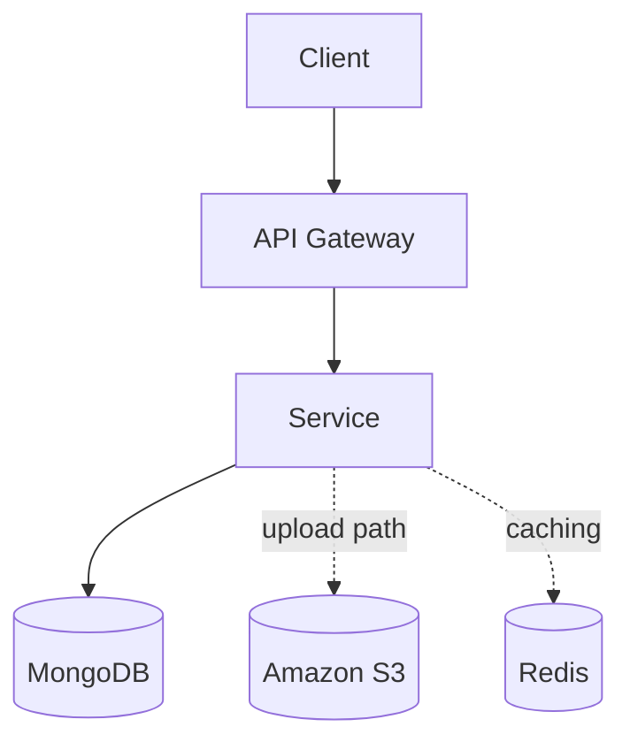

# HackSprint — Database & Storage

**Status:** Living document
**Scope:** Data storage systems and ownership
**Audience:** Engineers contributing to or operating HackSprint

See also: [`architecture.md`](./architecture.md), [`services.md`](./services.md), [`api-gateway.md`](./api-gateway.md).

---

## 1. Overview

HackSprint currently uses three storage systems, each chosen for a distinct job: MongoDB as the primary database, Redis as supporting infrastructure, and Amazon S3 for file storage. This is a polyglot persistence approach rather than a single-database design, and that choice is deliberate: no single storage system is well-suited to structured records, transient cache data, and large binary files at the same time. Forcing all three into one database — for example, storing uploaded files as binary blobs in MongoDB — would make the primary database slower and larger for no benefit, since MongoDB gains nothing from holding data it never needs to query. Splitting storage by access pattern instead means each system is only asked to do the kind of work it's actually good at.

---

## 2. MongoDB

MongoDB is HackSprint's primary database. It stores users, hackathons, submissions, media metadata, and notifications — every piece of structured, queryable data in the system lives here.

MongoDB was selected for a few concrete reasons. Its flexible schema fits a domain that is still evolving: hackathon and submission records vary in shape more than a fixed relational schema would comfortably accommodate at this stage. Its JSON-like document model maps closely onto how the application code already represents these objects, which keeps the translation between application logic and stored data simple. That fit supports rapid development, and integration with Mongoose gives the application layer schema validation and a consistent query interface without requiring a separate ORM abstraction to be built.

Although MongoDB runs as a single shared instance, ownership of the data within it is separated by service, matching the boundaries described in [`services.md`](./services.md). The Auth Service owns user-related collections. The Hackathon Service owns hackathons and submissions. The Media Service owns media metadata. The Notification Service owns notifications. Each service reads and writes only its own collections — the database is shared at the infrastructure level, but the data model each service works with is its own.

---

## 3. Redis

Redis is currently supporting infrastructure. It is used for caching where applicable, and its presence in the current deployment also serves as preparation for planned infrastructure work — the instance is already running and reachable from services, ahead of features described in Section 7. It is important to be precise about scope here: today, Redis's role is limited to caching. It is not currently used for rate limiting, and no rate-limiting logic runs against it yet — that remains a planned improvement, not a current capability.

---

## 4. Amazon S3

Amazon S3 stores image uploads, submission files, documents, and other large media assets. Files are stored in S3 rather than in MongoDB because the two systems are suited to different kinds of data: S3 is built for durable, scalable storage of large binary objects, while MongoDB is built for structured, queryable records. Storing large files directly in MongoDB would inflate the primary database's size and slow down the queries that actually matter for the application, without gaining anything — the application never needs to query into the contents of an uploaded file the way it queries structured fields.

The split in practice is clean: only metadata describing an uploaded file — its filename, ownership, and related references — is stored in MongoDB, owned by the Media Service. The binary file itself remains entirely in S3.

In production, access to S3 is granted through an IAM role attached to the infrastructure rather than through hardcoded AWS credentials stored in application code or configuration. This removes long-lived credentials from the codebase entirely and is standard practice for services running on AWS.

---

## 5. Data Flow

For most requests, a service reads from or writes to MongoDB and returns a response. When the request involves a media upload, the Media Service additionally writes the file to Amazon S3 and stores the corresponding metadata in MongoDB. Redis sits alongside this flow as supporting infrastructure rather than a step every request passes through.

---

## 6. Why This Design

The core decision underlying this design is separating structured data from file storage rather than treating everything as one undifferentiated data problem. Keeping MongoDB lightweight — free of large binary payloads — keeps queries against it fast as the dataset grows, since the collections it holds stay focused on the structured records the application actually queries against. Leveraging Amazon S3 as managed object storage means HackSprint doesn't need to build or operate its own file storage and durability guarantees; S3 already solves that problem at a level HackSprint doesn't need to reinvent. This separation also leaves room for future scaling: MongoDB and S3 can each be scaled or optimized independently, since neither one is bottlenecked by the other's workload.

---

## 7. Future Improvements

The following are planned but **not implemented** in the current system. Nothing below should be read as part of the current data layer described above.

- **Redis-backed rate limiting** — using the existing Redis instance (Section 3) to enforce per-user or per-IP request limits.
- **Caching improvements** — expanding Redis usage beyond its current scope.
- **MongoDB replication** — running MongoDB as a replica set for redundancy.
- **Automated backups** — scheduled, verified backups of the MongoDB dataset.
- **Read replicas** — offloading read traffic to replica instances.
- **Sharding** — horizontally partitioning MongoDB data as volume grows.
- **Database per service** — splitting the shared MongoDB instance into dedicated databases matching the logical ownership described in Section 2.
- **Lifecycle policies for S3** — automated transitions or expiration for stored objects.
- **CDN integration** — serving media assets through a content delivery network rather than directly from S3.

---

## 8. Tradeoffs

This design has clear advantages at HackSprint's current scale. It's architecturally simple: three storage systems, each with one clear job, rather than a sprawling set of specialized data stores. MongoDB's flexible schema supports fast, iterative development as the domain model evolves. S3 provides scalable object storage without HackSprint having to manage that infrastructure itself. And the overall setup is easy to develop against, since Mongoose and the AWS SDK are both well-understood tools with straightforward integration paths.

The disadvantages are real as well. MongoDB is currently a single shared instance rather than dedicated databases per service, so a MongoDB outage affects every service at once, and there's no logical enforcement preventing a service from reaching into another's collections beyond convention. There is no replication in place yet, meaning a single MongoDB instance is a single point of failure for the entire dataset. And Redis's caching usage is limited today, so the system doesn't yet benefit from more aggressive caching strategies.

This design is appropriate for the project's current size. Data volume and traffic don't yet justify the operational overhead of replica sets, sharding, or per-service databases — those become worth their complexity as the dataset and request volume grow, not before. A single MongoDB instance and a modest Redis footprint keep the system easy to operate and reason about while HackSprint is at this scale, with a clear path to each of the improvements in Section 7 when they're actually needed.

---

## 9. References

- [`architecture.md`](./architecture.md) — overall system architecture
- [`services.md`](./services.md) — service boundaries and data ownership
- [`api-gateway.md`](./api-gateway.md) — API Gateway routing and middleware
- [`observability.md`](./observability.md) — monitoring and metrics