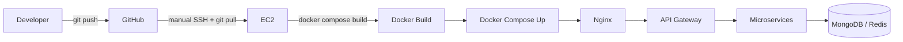
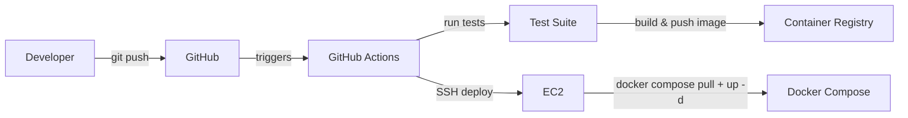

# Deployment

## Overview

This document covers provisioning a fresh EC2 host from nothing, and the day-to-day workflow for shipping a change to production. For the infrastructure itself, see [`infrastructure.md`](./infrastructure.md); for the containers being deployed, see [`docker.md`](./docker.md).

## Deployment Workflow



Today this is a **pull-based, manually-triggered** workflow: an engineer SSHes into the instance and runs the update steps below. See [After CI/CD](#after-github-actions-cicd) for how this changes once automated.

## Initial Server Setup

### Ubuntu Installation

Start from the official Ubuntu 22.04 LTS AMI. Update the base system immediately:

```bash
sudo apt-get update && sudo apt-get upgrade -y
sudo apt-get install -y curl git ufw fail2ban
```

### Docker Installation

```bash
curl -fsSL https://get.docker.com | sudo sh
sudo usermod -aG docker $USER
# log out and back in for group membership to apply
docker --version
```

### Docker Compose Installation

Recent Docker Engine installs the Compose plugin automatically (`docker compose`, no hyphen). Verify:

```bash
docker compose version
```

### Repository Cloning

```bash
git clone git@github.com:hacksprint/backend.git /opt/hacksprint
cd /opt/hacksprint
```

Using an SSH deploy key scoped read-only to this one repository, added to `~/.ssh/config` and the GitHub repo's Deploy Keys — not a personal developer key with broad account access.

### Environment Configuration

Each service directory contains a `.env.example`. Copy and fill in real values on the host only — `.env` files are `.gitignore`d and never committed:

```bash
for svc in services/*/; do cp "$svc/.env.example" "$svc/.env"; done
# edit each .env with production values (Mongo URI, JWT secret, etc.)
```

See [`security.md`](./security.md#secrets-management) for how secrets are handled and the plan to move off host-level `.env` files.

## Building and Running Containers

```bash
cd /opt/hacksprint
docker compose -f docker-compose.yml -f docker-compose.prod.yml build
docker compose -f docker-compose.yml -f docker-compose.prod.yml up -d
docker compose ps        # confirm all containers are "healthy"
```

## Restarting Containers

```bash
docker compose restart api-gateway          # single service
docker compose -f docker-compose.yml -f docker-compose.prod.yml restart   # everything
```

## Updating Deployment

Standard workflow for shipping a code change once the server is already provisioned:

```bash
cd /opt/hacksprint
git pull origin main
docker compose -f docker-compose.yml -f docker-compose.prod.yml build submission-service
docker compose -f docker-compose.yml -f docker-compose.prod.yml up -d submission-service
docker compose logs -f submission-service    # verify it started cleanly
```

Only the changed service is rebuilt and recreated — Docker Compose leaves untouched containers running, so a Submission Service deploy does not interrupt Auth or Leaderboard.

## Rolling Updates

At single-instance, single-replica-per-service scale, a "rolling update" is really: build the new image, then recreate the one container. There is a brief window (typically 1–3 seconds) where that one service is unavailable while the old container stops and the new one starts and passes its healthcheck. This is an accepted tradeoff at current scale — the alternative (zero-downtime blue-green) requires either multiple replicas behind a load balancer or an orchestrator, both covered in [`future-improvements.md`](./future-improvements.md#blue-green-deployment).

For the gateway specifically — the single point of failure for the whole API — deploys are done during low-traffic windows when possible, and never during an active event's judging window without a maintenance-mode banner on the frontend.

## Recovery After Reboot

`docker compose` restart policies (see [`docker.md`](./docker.md#restart-policies)) mean containers with `restart: unless-stopped` or `on-failure` come back automatically after the Docker daemon restarts. To guarantee the *whole stack* comes up after a full instance reboot (e.g., after an EC2 maintenance event), Docker itself is enabled to start on boot, and a systemd unit brings the Compose stack up:

```bash
sudo systemctl enable docker
```

```ini
# /etc/systemd/system/hacksprint.service
[Unit]
Description=HackSprint Docker Compose Stack
Requires=docker.service
After=docker.service

[Service]
Type=oneshot
RemainAfterExit=true
WorkingDirectory=/opt/hacksprint
ExecStart=/usr/bin/docker compose -f docker-compose.yml -f docker-compose.prod.yml up -d
ExecStop=/usr/bin/docker compose -f docker-compose.yml -f docker-compose.prod.yml down

[Install]
WantedBy=multi-user.target
```

```bash
sudo systemctl enable hacksprint.service
```

This means an EC2 reboot (scheduled maintenance, or a manual `sudo reboot` after a kernel/security update) requires zero manual steps to restore service.

## Useful Commands

```bash
docker compose ps                                   # what's running
docker compose logs -f --tail=200 <service>          # recent + live logs
docker compose exec <service> sh                     # shell into a container
df -h                                                 # check disk space (EBS root volume)
docker system df                                      # Docker's disk usage breakdown
sudo journalctl -u hacksprint.service                 # boot-time startup logs
```

## Production Tips

- Always `git pull` and inspect the diff before rebuilding on the production host — never edit files directly on the server.
- Run `docker compose logs -f <service>` for at least a minute after any deploy before considering it done; a service can pass its healthcheck and still error on the first real request.
- Keep a rollback path trivial: `git checkout <previous-sha> -- services/<service>` followed by a rebuild is the current rollback mechanism until CI/CD provides tagged, immutable image rollback (see below).
- Never run `docker compose down -v` on production — it deletes named volumes, including `mongodb_data`.

## After GitHub Actions CI/CD

Once CI/CD (tracked in [`future-improvements.md`](./future-improvements.md#github-actions)) is introduced, the workflow changes from pull-based/manual to push-based/automated:



Key differences from today:
- Images are built once in CI and tagged with the Git SHA, then **pulled** (not rebuilt) on the host — the host no longer needs the full source tree or a build toolchain, only Compose files and `.env`.
- Tests run automatically before any image is built, catching regressions before they reach production rather than relying on manual verification.
- Rollback becomes `docker compose pull <previous-sha-tag> && up -d` instead of a `git checkout` + rebuild, which is both faster and guarantees byte-identical images rather than trusting a fresh build to reproduce the old behavior.
- The manual SSH step in this document is replaced by a GitHub Actions job using an SSH deploy step (e.g., `appleboy/ssh-action`), triggered on merge to `main`.

## References

- [`docker.md`](./docker.md) — Compose architecture being deployed
- [`infrastructure.md`](./infrastructure.md) — the EC2 host itself
- [`troubleshooting.md`](./troubleshooting.md) — what to do when a deploy goes wrong
- [`future-improvements.md`](./future-improvements.md) — CI/CD and blue-green roadmap