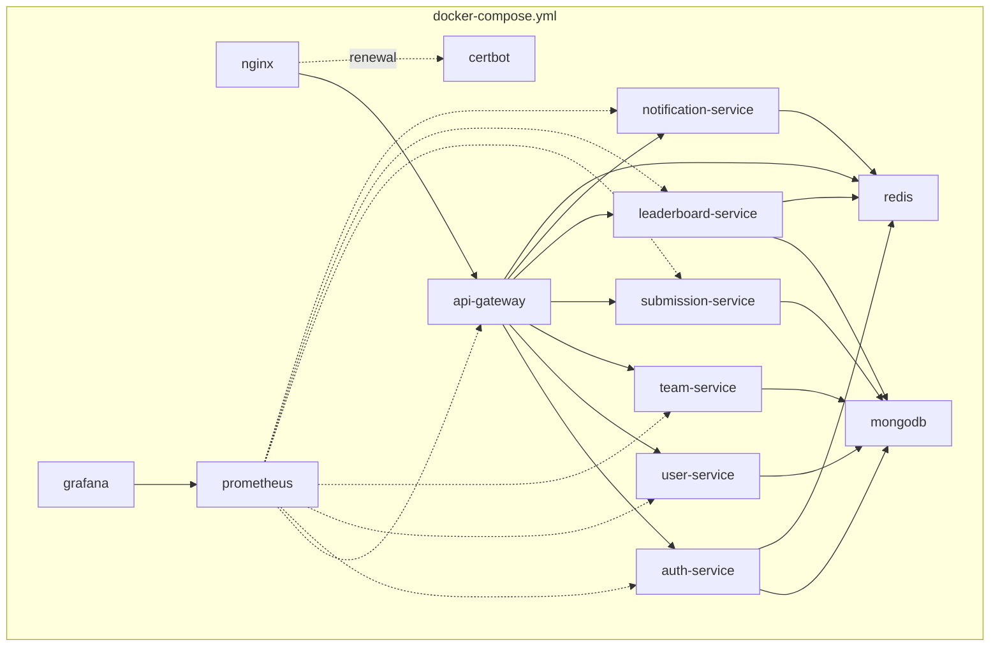
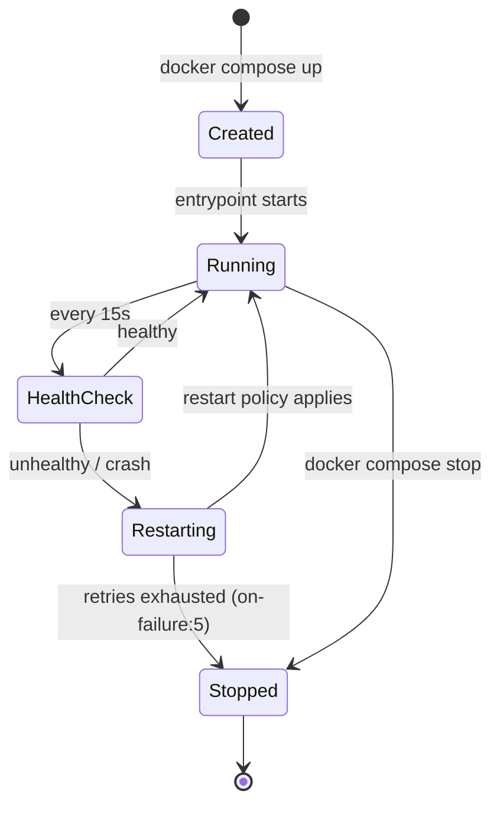

# Docker

## Overview

The entire backend — six domain services, the gateway, MongoDB, Redis, Prometheus, and Grafana — is defined in a single `docker-compose.yml` at the repository root. This document explains the Compose architecture, image strategy, networking, volumes, and container lifecycle. For the EC2 host that runs this, see [`infrastructure.md`](./infrastructure.md) and [`deployment.md`](./deployment.md).

## Docker Compose Architecture



## Images

| Service | Base image | Notes |
|---|---|---|
| `api-gateway`, all domain services | `node:20-alpine` (multi-stage build) | Custom image built from repo source |
| `nginx` | `nginx:1.25-alpine` | Custom config mounted, no custom image build needed |
| `mongodb` | `mongo:6.0` | Official image, no customization |
| `redis` | `redis:7-alpine` | Official image, `--appendonly yes` for durability |
| `prometheus` | `prom/prometheus:v2.51.0` | Official image, custom `prometheus.yml` mounted |
| `grafana` | `grafana/grafana:10.4.0` | Official image, provisioned dashboards mounted |
| `certbot` | `certbot/certbot` | Run on-demand/via cron, not a long-lived container |

### Application Dockerfile (multi-stage)

Every Node service shares the same Dockerfile pattern — a build stage compiles TypeScript, a slim runtime stage copies only the compiled output and production `node_modules`, keeping final images small and reducing attack surface:

```dockerfile
# ---- build stage ----
FROM node:20-alpine AS build
WORKDIR /app
COPY package*.json ./
RUN npm ci
COPY . .
RUN npm run build

# ---- runtime stage ----
FROM node:20-alpine
WORKDIR /app
ENV NODE_ENV=production
COPY package*.json ./
RUN npm ci --omit=dev
COPY --from=build /app/dist ./dist
USER node
EXPOSE 4000
HEALTHCHECK --interval=15s --timeout=5s --retries=3 \
  CMD node dist/healthcheck.js || exit 1
CMD ["node", "dist/index.js"]
```

Running as the non-root `node` user (built into the base image) is a deliberate hardening choice — see [`security.md`](./security.md#docker-security).

## Containers

Each service runs as exactly one container per host in the current single-instance topology. Container names match service names (`auth-service`, `mongodb`, etc.), which doubles as their DNS hostname on `hacksprint-net`.

## Networks

```yaml
networks:
  hacksprint-net:
    driver: bridge
```

A single user-defined bridge network is used instead of the Compose default network because user-defined bridges give reliable automatic DNS resolution by container name (the default bridge network does not). Only `nginx` publishes ports to the host; every other container is reachable exclusively from within `hacksprint-net`, so MongoDB and Redis are never exposed to the internet even by misconfiguration of the host firewall.

## Volumes

```yaml
volumes:
  mongodb_data:
  redis_data:
  prometheus_data:
  grafana_data:
  certbot_certs:
  certbot_www:
```

| Volume | Mounted in | Purpose |
|---|---|---|
| `mongodb_data` | `mongodb` at `/data/db` | Database files — must survive container recreation |
| `redis_data` | `redis` at `/data` | AOF persistence file |
| `prometheus_data` | `prometheus` at `/prometheus` | Metrics TSDB |
| `grafana_data` | `grafana` at `/var/lib/grafana` | Dashboards, users, datasources |
| `certbot_certs` | `nginx`, `certbot` | Let's Encrypt certificates, shared between renewal and serving |
| `certbot_www` | `nginx`, `certbot` | ACME HTTP-01 challenge files |

Named Docker volumes (not bind mounts) are used for stateful data so Docker manages the storage lifecycle explicitly and volumes aren't accidentally deleted by a careless `rm -rf` on a host directory. See [`mongodb.md`](./mongodb.md#backups) for how `mongodb_data` is backed up despite living inside a Docker-managed volume.

## Restart Policies

All application services use `restart: on-failure:5` (retry up to 5 times with backoff, then stop and require manual investigation — an unbounded restart loop on a genuinely broken deployment would just spam logs and mask the real problem). Infrastructure containers (`mongodb`, `redis`, `nginx`) use `restart: unless-stopped` so they always come back after a host reboot unless explicitly stopped by an operator.

```yaml
services:
  submission-service:
    restart: on-failure:5
  mongodb:
    restart: unless-stopped
```

## Build Process

```bash
docker compose build              # rebuild all images from current source
docker compose build submission-service   # rebuild a single service
```

The build context for each application service is scoped to its own directory (`services/submission-service/`) with a `.dockerignore` excluding `node_modules` and `dist`, keeping build context upload fast and images reproducible from source rather than from a developer's local `dist` folder.

## Development vs. Production

| Aspect | Development (`docker-compose.dev.yml`) | Production (`docker-compose.yml` + `docker-compose.prod.yml`) |
|---|---|---|
| Source mounting | Bind-mounted with `nodemon` for hot reload | Baked into image, no bind mounts |
| Ports | Every service port published to host for direct debugging | Only Nginx published |
| `NODE_ENV` | `development` | `production` |
| Mongo/Redis | Ephemeral (no named volume) | Named volumes, persistent |
| TLS | None, plain HTTP on `localhost` | Full Let's Encrypt via `nginx.md` |

Compose file overlays are combined at build/run time:

```bash
# development
docker compose -f docker-compose.yml -f docker-compose.dev.yml up

# production (on EC2)
docker compose -f docker-compose.yml -f docker-compose.prod.yml up -d
```

## Container Lifecycle



Docker's `HEALTHCHECK` (defined per-Dockerfile, see above) is what Docker itself uses to mark a container `unhealthy`; Prometheus and the gateway's own dependency checks (`GET /health`, see [`services.md`](./services.md#cross-service-conventions)) are a separate, application-level signal used for alerting, not for triggering restarts.

## Persistent Storage

Persistent storage is limited deliberately to MongoDB, Redis, Prometheus, Grafana, and TLS certificates — every application service container is otherwise fully disposable and stateless, which is what makes `restart: on-failure` and rolling recreation safe. See [`deployment.md`](./deployment.md#rolling-updates).

## Useful Commands

```bash
docker compose ps                         # container status
docker compose logs -f submission-service # tail logs for one service
docker compose exec mongodb mongosh       # shell into MongoDB
docker compose restart auth-service       # restart a single service
docker compose down                       # stop and remove containers (volumes persist)
docker compose down -v                    # DANGER: also removes named volumes
docker system prune -f                    # reclaim disk from dangling images/layers
```

## Production Recommendations

- Pin image tags (`mongo:6.0`, not `mongo:latest`) — already done above — to avoid an unplanned major-version upgrade on a routine `docker compose pull`.
- Set memory limits (`mem_limit`) per service once traffic patterns are well understood, so a single leaking container cannot exhaust host memory and take down unrelated containers — see [`troubleshooting.md`](./troubleshooting.md#memory-issues--oom-kills).
- Run `docker system prune` on a schedule (or via a small cron job) to prevent disk exhaustion from accumulated build layers on the EC2 host.

## References

- [`deployment.md`](./deployment.md) — how this Compose setup is deployed and updated on EC2
- [`infrastructure.md`](./infrastructure.md) — the host these containers run on
- [`security.md`](./security.md#docker-security) — container hardening details