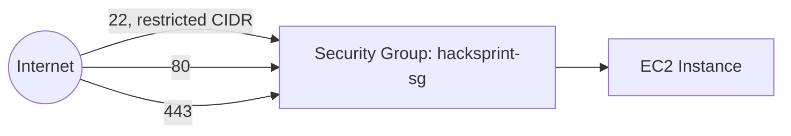

# Infrastructure

## Overview

HackSprint's backend runs on a single AWS EC2 instance. This document covers the host itself, networking/Security Groups, storage, and the IAM role that replaces static AWS credentials. For what runs *on* the host, see [`docker.md`](./docker.md); for how it got there, see [`deployment.md`](./deployment.md).

## Instance

| Property | Value |
|---|---|
| Instance type | `t3.medium` (2 vCPU, 4 GiB RAM) |
| OS | Ubuntu 22.04 LTS |
| Region | Single region, single AZ (see [Future Improvements](./future-improvements.md) for multi-AZ plans) |
| Storage | 40 GiB `gp3` EBS root volume |
| Elastic IP | Yes — attached, so the DNS record and TLS certificate survive an instance stop/start |

**Why `t3.medium` and not larger:** it comfortably runs all containers (each Node service is small, MongoDB and Redis working sets are modest at current data volume) with headroom for the judging-window burst, verified via Grafana host-level dashboards (see [`grafana.md`](./grafana.md)). Resized only when metrics show sustained CPU/memory pressure, not preemptively.

**Why a single instance and not multiple:** see [Deployment Philosophy](./architecture.md#deployment-philosophy) — this is a deliberate, revisited-when-justified tradeoff, not an oversight.

## Networking



### Security Group Rules

| Direction | Port | Protocol | Source | Purpose |
|---|---|---|---|---|
| Inbound | 22 | TCP | Restricted to team's static IP / VPN CIDR | SSH administration |
| Inbound | 80 | TCP | `0.0.0.0/0` | HTTP (redirects to HTTPS) |
| Inbound | 443 | TCP | `0.0.0.0/0` | HTTPS |
| Outbound | all | all | `0.0.0.0/0` | Required for package installs, Docker Hub, SES, S3 |

No other ports are open at the Security Group level — MongoDB (27017), Redis (6379), and every internal service port are only reachable inside the Docker bridge network, not the host's network interface, and are additionally not present in the Security Group's inbound rules as defense in depth. See [`security.md`](./security.md#firewall) for the host-level `ufw` configuration layered under this.

## IAM Role

### Why IAM Roles Are Preferred

The EC2 instance has an attached IAM role (`hacksprint-ec2-role`) rather than the application code holding static AWS access keys (`AWS_ACCESS_KEY_ID` / `AWS_SECRET_ACCESS_KEY`) in an environment file.

### Temporary Credentials

The role provides temporary, auto-rotating credentials via the EC2 Instance Metadata Service (IMDSv2). The AWS SDK fetches these transparently — no code needs to request or refresh them explicitly.

### AWS SDK Credential Resolution

The AWS SDK's default credential provider chain checks, in order: explicit code-provided credentials → environment variables → shared credentials file → **EC2 instance metadata**. Because no credentials are set anywhere earlier in that chain, every service that uses the AWS SDK (User Service and Submission Service for S3 pre-signed URLs, Notification Service for SES) automatically resolves the instance role's temporary credentials with zero configuration.

### Why Access Keys Were Removed

An earlier iteration of the project used a static IAM user access key in `.env`. This was deliberately removed because:
- A leaked long-lived key (committed by accident, or exfiltrated from a compromised container) grants standing access until manually rotated; instance-role credentials expire automatically within hours and are never present in any file on disk or in source control.
- Static keys must be manually rotated; instance-role credentials rotate automatically with no operational burden.
- Static keys are copy-pasteable between environments (a habit that leads to using prod keys in dev); an instance role is physically bound to the specific EC2 instance.

### IAM Policy (attached to `hacksprint-ec2-role`)

```json
{
  "Version": "2012-10-17",
  "Statement": [
    {
      "Effect": "Allow",
      "Action": ["s3:PutObject", "s3:GetObject"],
      "Resource": "arn:aws:s3:::hacksprint-submissions/*"
    },
    {
      "Effect": "Allow",
      "Action": ["ses:SendEmail", "ses:SendRawEmail"],
      "Resource": "*"
    }
  ]
}
```

Scoped to exactly the two capabilities the application needs (write submission attachments to one specific bucket, send email) — not `s3:*` or `*` resource wildcards. This is least-privilege applied at the infrastructure level.

### Security Benefits

Compromise of a single container (e.g., a dependency vulnerability in the Notification Service) exposes only what that role can do — send email and touch one S3 bucket — never broader account access, since no IAM user credentials exist to steal in the first place.

### Production Recommendations

- Review the attached policy whenever a service gains a new AWS integration; keep it additive and specific rather than broadening to wildcard actions.
- When infrastructure moves to ECS/EKS (see [`future-improvements.md`](./future-improvements.md)), migrate from one shared EC2 instance role to per-service IAM roles (ECS task roles), so the Notification Service's SES permission is not implicitly available to every other container on the host as it technically is today under one shared instance role.

## Storage

| Store | Type | Backed up |
|---|---|---|
| EBS root volume | `gp3`, 40 GiB | AMI snapshot, weekly (manual today, see [`future-improvements.md`](./future-improvements.md) for automation) |
| `mongodb_data` volume | Docker named volume on root EBS | `mongodump` to S3, daily — see [`mongodb.md`](./mongodb.md#backups) |
| S3 (`hacksprint-submissions`) | Object storage, versioning enabled | Inherently durable (S3 11 nines); versioning protects against accidental overwrite |

## References

- [`docker.md`](./docker.md) — what runs on this host
- [`deployment.md`](./deployment.md) — provisioning and deployment steps
- [`security.md`](./security.md) — full security posture including IAM, firewall, and secrets