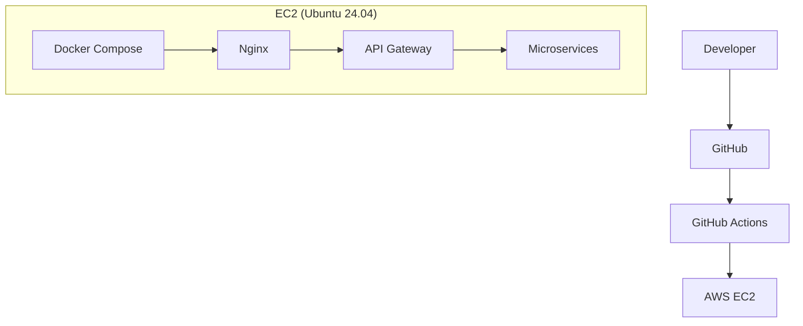
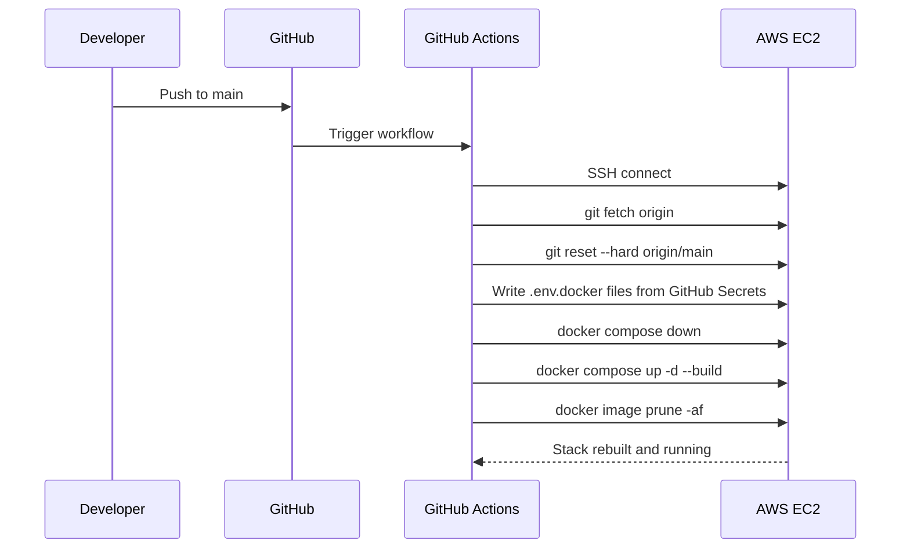

# HackSprint — Infrastructure & Observability

**Status:** Living document
**Scope:** Production deployment, CI/CD, and monitoring
**Audience:** Engineers contributing to or operating HackSprint

See also: [`architecture.md`](./architecture.md), [`api-gateway.md`](./api-gateway.md), [`services.md`](./services.md).

---

## 1. Overview

HackSprint's production infrastructure runs on a single AWS EC2 instance, provisioned with Ubuntu 24.04. Docker and Docker Compose containerize and orchestrate every component of the system. Nginx sits at the network edge, terminating HTTPS via a Let's Encrypt certificate and forwarding traffic inward. GitHub Actions drives continuous deployment from the main branch. Prometheus and Grafana provide metrics collection and visualization. Access to AWS resources is granted through IAM roles rather than static credentials.

---

## 2. Deployment Architecture



A push to the main branch is what initiates a deployment; there is no manual deployment step in the normal workflow. Everything from that push to the containers restarting on EC2 is handled by the pipeline described in Section 6.

---

## 3. Docker

Every service in HackSprint runs inside its own Docker container, and Docker Compose orchestrates the full application as a single unit — bringing up, tearing down, and networking all containers together with one configuration. Containers communicate with each other over Docker's internal network rather than over the public internet, which keeps inter-service and service-to-database traffic off any externally reachable interface.

The containers that currently make up the deployment are: the API Gateway, the Auth Service, the Hackathon Service, the Media Service, the Notification Service, MongoDB, Redis, Nginx, Prometheus, and Grafana.

Each of the five application services (the four microservices plus the gateway), plus Grafana, loads its runtime configuration from its own `.env.docker` file via Compose's `env_file` directive, rather than from environment variables baked into the image or a single shared `.env`. These files are never committed to the repository; how they get onto the EC2 host in the first place is described in Section 7.

---

## 4. Nginx

Nginx is responsible for HTTPS termination, acting as the reverse proxy for the entire platform, and forwarding all incoming traffic to the API Gateway. It also handles the platform's custom domain, meaning it's the component responsible for HackSprint being reachable at a human-readable address rather than a bare EC2 host.

---

## 5. HTTPS

TLS is handled using a Let's Encrypt certificate, which provides automatic SSL for the platform's custom domain. This gives HackSprint secure, encrypted communication between clients and Nginx without the operational overhead of managing certificates manually — Let's Encrypt's automation handles issuance and renewal.

---

## 6. AWS

Production infrastructure runs on a single AWS EC2 instance running Ubuntu 24.04, with the full application deployed via Docker as described in Section 3. AWS access — specifically, access to Amazon S3 for the Media Service — is granted through an IAM role attached to the instance, rather than through AWS credentials stored in application code, environment files, or anywhere else in the codebase. This means the Media Service can read and write to S3 without any AWS secret ever existing in the repository or the deployed containers.

---

## 7. CI/CD

Deployment is automated through a single GitHub Actions workflow (`.github/workflows/deploy.yml`) that triggers on every push to `main`. The workflow does not build anything on GitHub's own runners — its entire job is to SSH into the EC2 instance (via `appleboy/ssh-action`) and drive the deployment from there, so the build happens on the same host it will run on.

Once connected, the workflow, in order:

1. **Syncs the code.** `git fetch origin` followed by `git reset --hard origin/main` — a hard reset rather than a `pull`, so the EC2 checkout always matches `main` exactly regardless of any local drift on the instance.
2. **Materializes the environment files.** Each service's runtime configuration lives in a `.env.docker` file that is `.gitignore`d and never committed — Docker Compose loads it per-service via `env_file` (see Section 3). The workflow recreates all six of these files (`auth-service`, `hackathon-service`, `media-service`, `notification-service`, `api-gateway`, `grafana`) on every run, writing each one from a same-named GitHub Actions secret (`AUTH_ENV`, `HACKATHON_ENV`, `MEDIA_ENV`, `NOTIFICATION_ENV`, `API_GATEWAY_ENV`, `GRAFANA_ENV`) via a heredoc. This means the EC2 instance's environment files are fully reproducible from GitHub's secret store rather than being hand-maintained, one-off files that could drift from what's actually configured.
3. **Recreates the stack.** `docker compose -f docker-compose.prod.yml down`, then `docker compose -f docker-compose.prod.yml up -d --build` — an explicit `down` before the rebuild, rather than relying on `up`'s in-place container replacement, so every container (including ones whose image didn't change) restarts cleanly against the freshly written environment files.
4. **Cleans up.** `docker image prune -af` removes now-unreferenced images left behind by the rebuild, so successive deploys don't slowly fill the instance's disk with stale layers.

There is no manual step anywhere in this sequence — a merge to `main` is a production deploy.



This design has one notable operational implication worth stating plainly: because the `.env.docker` files are rewritten from secrets on *every* deploy, a secret's value in GitHub is the single source of truth for that service's production configuration — editing a `.env.docker` file by hand directly on the EC2 instance will be silently overwritten on the next push to `main`.

---

## 8. Prometheus

Prometheus handles metrics scraping across the platform. Each instrumented service exposes a `/metrics` endpoint, and Prometheus periodically scrapes it to collect application metrics. This gives operators a consistent, service-by-service view of what's happening inside the system without needing to log into individual containers.

Prometheus has no authentication of its own, so it is never exposed on the public domain or through Nginx. In `docker-compose.prod.yml` it's published as `127.0.0.1:9090:9090` — bound to the EC2 host's loopback interface only. That means the port exists on the instance but is unreachable from the internet regardless of security group rules; the only way to reach it is by SSH-tunneling into the instance (Section 9.1) as whoever holds SSH access to the box.

---

## 9. Grafana

Grafana provides visualization on top of the metrics Prometheus collects, presenting dashboards that make it possible to monitor service health and system metrics at a glance rather than querying raw metrics data directly. The Prometheus datasource is auto-provisioned on startup from `grafana/provisioning/datasources/prometheus.yml` (committed, non-secret — it just points at `http://prometheus:9090` over the internal Docker network), so a fresh deploy comes up already wired to Prometheus without any manual click-through setup.

Admin credentials come from `grafana/.env.docker` (`GF_SECURITY_ADMIN_USER` / `GF_SECURITY_ADMIN_PASSWORD`), provisioned from the `GRAFANA_ENV` GitHub secret the same way the five application services get their own `.env.docker` files (Section 7) — this replaces Grafana's `admin`/`admin` default. `GF_USERS_ALLOW_SIGN_UP=false` is set directly in Compose to disable open self-registration.

Like Prometheus, Grafana is published as `127.0.0.1:3001:3000` — loopback-only, not reachable from the internet. Grafana does have its own login, but keeping it off the public internet entirely means that login isn't the only thing standing between the dashboard and the internet.

### 9.1 Accessing Prometheus / Grafana

Both are reached the same way: SSH-tunnel into the EC2 instance, then browse to the forwarded port on your own machine.

```bash
ssh -L 9090:localhost:9090 -L 3001:localhost:3001 <ec2-user>@<EC2_HOST>
```

Then open `http://localhost:9090` for Prometheus and `http://localhost:3001` for Grafana. This only works for someone who already holds SSH access to the instance — there is no other route in.

---

## 10. Current Implementation Summary

The current production setup consists of Docker and Docker Compose for containerization and orchestration, GitHub Actions for automated CI/CD, a single AWS EC2 instance for hosting, Nginx for HTTPS termination and reverse proxying, Let's Encrypt-issued certificates for HTTPS, Prometheus for metrics collection, Grafana for metrics visualization, and IAM roles for AWS access in place of stored credentials.

---

## 11. Future Improvements

The following are planned but **not implemented** in the current infrastructure. Nothing below reflects the system as it exists today.

- **Alertmanager** — automated alerting on top of existing Prometheus metrics.
- **Loki** — log aggregation to pair with the existing Prometheus/Grafana metrics stack.
- **Centralized logging** — aggregating logs from all containers into a single searchable store.
- **Distributed tracing** — tracing a single request as it crosses service boundaries.
- **Docker image optimization** — reducing image size and build time.
- **Blue-green deployment** — running two production environments to enable zero-downtime cutovers.
- **Rolling updates** — updating containers incrementally rather than via a full restart.
- **Kubernetes** — migrating orchestration from Docker Compose to Kubernetes.
- **Horizontal scaling** — running multiple instances of individual services.
- **Automatic backups** — scheduled, verified backups of production data.

---

## 12. Tradeoffs

The current infrastructure has clear advantages for a project at HackSprint's stage. Deployment is simple: one EC2 instance, one Docker Compose file, one GitHub Actions workflow. Maintenance is easy for the same reason — there's a single environment to reason about, not a fleet. The setup is genuinely production-ready in the sense that mattered for launch: HTTPS, automated deployment, and IAM-based credential handling are all in place rather than deferred. Deployment itself is automated end-to-end from a push to main, and the infrastructure is secure by default, with no long-lived AWS credentials anywhere in the system.

The disadvantages are the direct consequence of running on a single instance: there is a single EC2 instance, which means no redundancy if that instance fails. There is no container orchestration beyond Docker Compose, so there's no automatic rescheduling if a container crashes outside of Compose's own restart behavior. And scaling today is manual — meeting increased load means manually resizing or reconfiguring the instance, not an automated response to demand.

This deployment is appropriate for HackSprint's current scale. A single EC2 host is sufficient capacity for current traffic, and the operational simplicity of one Compose file and one deployment pipeline is a genuine advantage while the team and user base are small — every additional layer of orchestration or redundancy also adds something that has to be understood, configured, and maintained. The items in Section 11 represent the natural next steps once traffic, team size, or availability requirements outgrow what a single host can reasonably provide.

---

## 13. References

- [`architecture.md`](./architecture.md) — overall system architecture
- [`api-gateway.md`](./api-gateway.md) — API Gateway routing and middleware
- [`services.md`](./services.md) — service boundaries and responsibilities