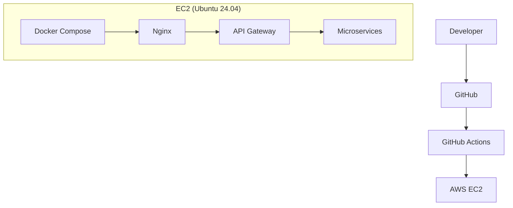
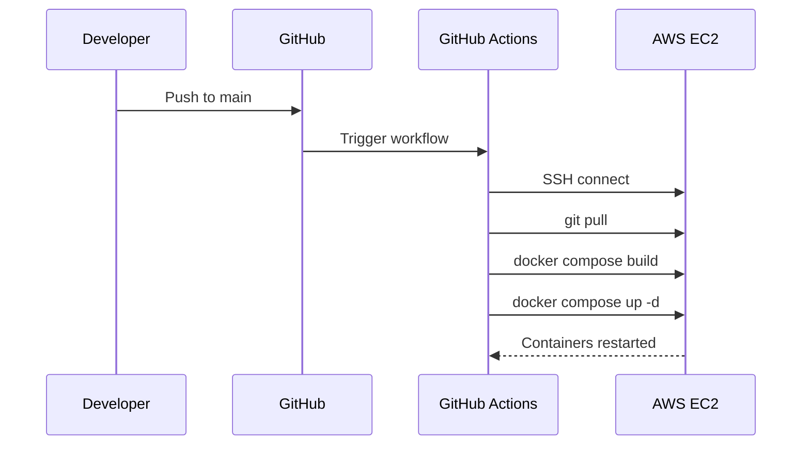

# HackSprint — Infrastructure & Observability

**Status:** Living document
**Scope:** Production deployment, CI/CD, and monitoring
**Audience:** Engineers contributing to or operating HackSprint

See also: [`architecture.md`](./architecture.md), [`api-gateway.md`](./api-gateway.md), [`services.md`](./services.md), [`database.md`](./database.md).

---

## 1. Overview

HackSprint's production infrastructure runs on a single AWS EC2 instance, provisioned with Ubuntu 24.04. Docker and Docker Compose containerize and orchestrate every component of the system. Nginx sits at the network edge, terminating HTTPS via a Let's Encrypt certificate and forwarding traffic inward. GitHub Actions drives continuous deployment from the main branch. Prometheus and Grafana provide metrics collection and visualization. Access to AWS resources is granted through IAM roles rather than static credentials.

---

## 2. Deployment Architecture

A push to the main branch is what initiates a deployment; there is no manual deployment step in the normal workflow. Everything from that push to the containers restarting on EC2 is handled by the pipeline described in Section 6.

---

## 3. Docker

Every service in HackSprint runs inside its own Docker container, and Docker Compose orchestrates the full application as a single unit — bringing up, tearing down, and networking all containers together with one configuration. Containers communicate with each other over Docker's internal network rather than over the public internet, which keeps inter-service and service-to-database traffic off any externally reachable interface.

The containers that currently make up the deployment are: the API Gateway, the Auth Service, the Hackathon Service, the Media Service, the Notification Service, MongoDB, Redis, Nginx, Prometheus, and Grafana.

---

## 4. Nginx

Nginx is responsible for HTTPS termination, acting as the reverse proxy for the entire platform, and forwarding all incoming traffic to the API Gateway. It also handles the platform's custom domain, meaning it's the component responsible for HackSprint being reachable at a human-readable address rather than a bare EC2 host.

---

## 5. HTTPS

TLS is handled using a Let's Encrypt certificate, which provides automatic SSL for the platform's custom domain. This gives HackSprint secure, encrypted communication between clients and Nginx without the operational overhead of managing certificates manually — Let's Encrypt's automation handles issuance and renewal.

---

## 6. AWS

Production infrastructure runs on a single AWS EC2 instance running Ubuntu 24.04, with the full application deployed via Docker as described in Section 3. AWS access — specifically, access to Amazon S3 for the Media Service — is granted through an IAM role attached to the instance, rather than through AWS credentials stored in application code, environment files, or anywhere else in the codebase. This means the Media Service can read and write to S3 without any AWS secret ever existing in the repository or the deployed containers.

---

## 7. CI/CD

Deployment is automated through GitHub Actions. When a developer pushes code, GitHub Actions runs a workflow that connects to the EC2 instance over SSH, pulls the latest code with `git pull`, rebuilds the affected containers via Docker Compose, and restarts them. This sequence runs automatically after every push to `main` — there is no manual step between a merged change and it running in production.

---

## 8. Prometheus

Prometheus handles metrics scraping across the platform. Each instrumented service exposes a `/metrics` endpoint, and Prometheus periodically scrapes it to collect application metrics. This gives operators a consistent, service-by-service view of what's happening inside the system without needing to log into individual containers.

---

## 9. Grafana

Grafana provides visualization on top of the metrics Prometheus collects, presenting dashboards that make it possible to monitor service health and system metrics at a glance rather than querying raw metrics data directly.

---

## 10. Current Implementation Summary

The current production setup consists of Docker and Docker Compose for containerization and orchestration, GitHub Actions for automated CI/CD, a single AWS EC2 instance for hosting, Nginx for HTTPS termination and reverse proxying, Let's Encrypt-issued certificates for HTTPS, Prometheus for metrics collection, Grafana for metrics visualization, and IAM roles for AWS access in place of stored credentials.

---

## 11. Future Improvements

The following are planned but **not implemented** in the current infrastructure. Nothing below reflects the system as it exists today.

- **Alertmanager** — automated alerting on top of existing Prometheus metrics.
- **Loki** — log aggregation to pair with the existing Prometheus/Grafana metrics stack.
- **Centralized logging** — aggregating logs from all containers into a single searchable store.
- **Distributed tracing** — tracing a single request as it crosses service boundaries.
- **Docker image optimization** — reducing image size and build time.
- **Blue-green deployment** — running two production environments to enable zero-downtime cutovers.
- **Rolling updates** — updating containers incrementally rather than via a full restart.
- **Kubernetes** — migrating orchestration from Docker Compose to Kubernetes.
- **Horizontal scaling** — running multiple instances of individual services.
- **Automatic backups** — scheduled, verified backups of production data.

---

## 12. Tradeoffs

The current infrastructure has clear advantages for a project at HackSprint's stage. Deployment is simple: one EC2 instance, one Docker Compose file, one GitHub Actions workflow. Maintenance is easy for the same reason — there's a single environment to reason about, not a fleet. The setup is genuinely production-ready in the sense that mattered for launch: HTTPS, automated deployment, and IAM-based credential handling are all in place rather than deferred. Deployment itself is automated end-to-end from a push to main, and the infrastructure is secure by default, with no long-lived AWS credentials anywhere in the system.

The disadvantages are the direct consequence of running on a single instance: there is a single EC2 instance, which means no redundancy if that instance fails. There is no container orchestration beyond Docker Compose, so there's no automatic rescheduling if a container crashes outside of Compose's own restart behavior. And scaling today is manual — meeting increased load means manually resizing or reconfiguring the instance, not an automated response to demand.

This deployment is appropriate for HackSprint's current scale. A single EC2 host is sufficient capacity for current traffic, and the operational simplicity of one Compose file and one deployment pipeline is a genuine advantage while the team and user base are small — every additional layer of orchestration or redundancy also adds something that has to be understood, configured, and maintained. The items in Section 11 represent the natural next steps once traffic, team size, or availability requirements outgrow what a single host can reasonably provide.

---

## 13. References

- [`architecture.md`](./architecture.md) — overall system architecture
- [`api-gateway.md`](./api-gateway.md) — API Gateway routing and middleware
- [`services.md`](./services.md) — service boundaries and responsibilities
- [`database.md`](./database.md) — storage systems and data ownership