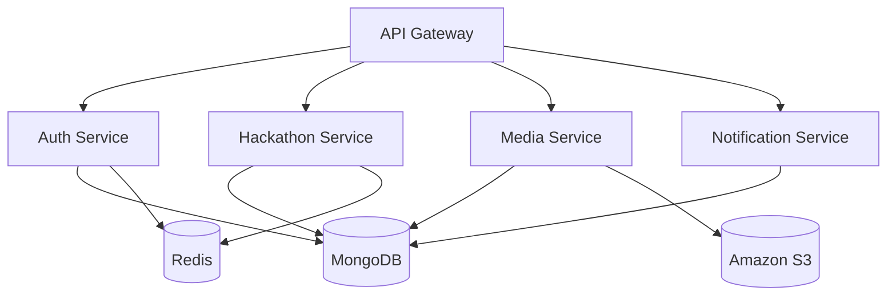
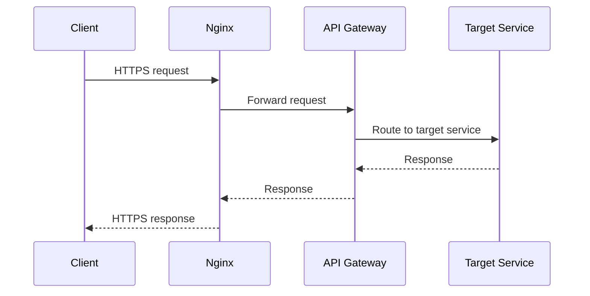

# HackSprint — Services

**Status:** Living document
**Scope:** Service boundaries and responsibilities
**Audience:** Engineers contributing to or operating HackSprint

See also: [`architecture.md`](./architecture.md) for the overall system view and [`api-gateway.md`](./api-gateway.md) for how requests reach these services.

---

## 1. Overview

HackSprint's production system consists of four independent services: the Auth Service, the Hackathon Service, the Media Service, and the Notification Service. Each is an independent Express.js application with its own routes, controllers, models, middleware, and business logic — there is no shared application code between them beyond what each pulls in as its own dependencies. Services communicate synchronously over HTTP, and all traffic reaches them through the API Gateway rather than directly. Docker Compose orchestrates all four services as part of a single deployment.

MongoDB is shared across all four services as the primary datastore. Redis is supporting infrastructure, currently used by the Auth and Hackathon services. Amazon S3 is used exclusively by the Media Service — no other service reads from or writes to S3 directly.

---

## 2. Auth Service

The Auth Service is responsible for authentication, authorization, and user management. This includes Google OAuth login, JWT generation, email verification, password reset, and general account management. All authentication-related logic in the system is isolated inside this service — no other service issues tokens, verifies credentials, or manages user records.

User information is stored in MongoDB, owned by this service. Isolating authentication into a single service means every other service can treat "who is this user" as a solved problem handled elsewhere, rather than re-implementing credential handling four times.

The current implementation issues short-lived JWT access tokens paired with a refresh-token flow (`POST /refresh-token`), so a client can silently obtain a new access token without forcing the user to log in again. Admin authentication runs the same pattern independently: the Hackathon Service's admin-auth routes (Section 3) expose their own `POST /refresh-token` endpoint, issuing and refreshing admin tokens separately from student tokens. The frontend treats these as two independent sessions — refreshing an admin token never blocks or interferes with a student token refresh in the same browser tab, and vice versa.

---

## 3. Hackathon Service

The Hackathon Service owns hackathon management: creating, reading, updating, and deleting hackathons, along with the associated business logic for hackathon information, submission metadata, registrations, teams, judging, and participant-related operations. All hackathon-specific business rules live here — the Hackathon Service is the single source of truth for what a hackathon is, what a submission looks like at the metadata level, and how participants, teams, and judges relate to a given hackathon.

This is the largest and most stateful of the four services, and it has its own internal authentication surface separate from the Auth Service: **admin authentication** (`/admin/auth` — Google OAuth login plus its own independent access/refresh-token pair and logout, mirroring the Auth Service's pattern for students) and **admin/judge operations** (`/platform/admin` — assigning and removing judges on a hackathon, reviewing and approving/rejecting admin verification requests, and admin/judge profile management). Judges authenticate as admins and are scoped to only the hackathons they've been assigned to.

The service also owns **discussion threads** (`/api/discussions` — per-hackathon messages and threaded replies) and the platform's only scheduled background job: an hourly `node-cron` task that scans for registration/submission phases ending within 24 hours and fires "closing soon" notifications to the users who still need to act — wishlisted-but-unregistered users for a closing registration window, and registered participants/teams who haven't yet submitted for a closing submission window. Each phase is only reminded once, tracked via a `reminderSent` flag on the phase subdocument itself.

This service does not manage the actual submission files themselves; file storage and file metadata management for uploads is the Media Service's responsibility (Section 4). The Hackathon Service deals with the hackathon-domain data that references those uploads, not the uploads themselves.

---

## 4. Media Service

The Media Service is responsible for media uploads — image uploads, document uploads, and submission files — and for the corresponding Amazon S3 integration. It generates upload responses for clients and manages the metadata associated with uploaded assets.

The split here is deliberate: the actual binary files live in Amazon S3, while metadata describing those files — filenames, references, ownership — is stored in MongoDB. This keeps large binary payloads out of the primary database entirely, letting MongoDB stay focused on structured, queryable data while S3 handles what it's built for: durable, scalable object storage.

---

## 5. Notification Service

The Notification Service is responsible for notification management (creating notifications and reading notifications back through its APIs) and for transactional email delivery. In-app notification creation happens synchronously, the same as any other internal service call. Email is different: the Auth Service enqueues email jobs onto a BullMQ/Redis queue rather than calling out synchronously, and the Notification Service runs a BullMQ worker that consumes those jobs and sends the actual email through Brevo's transactional email API using Handlebars-rendered templates. This queue is the one asynchronous, message-passing exception in an otherwise synchronous-HTTP system.

---

## 6. Service Communication

All communication into the system follows the same path regardless of which service ultimately handles it: client, through Nginx, through the API Gateway, to the target service.

Services communicate synchronously over HTTP for nearly everything, and most service-to-service calls follow the same synchronous request/response model as client-facing traffic. The one exception is transactional email: the Auth Service pushes email jobs onto a BullMQ/Redis queue instead of calling the Notification Service directly, and the Notification Service's worker consumes them asynchronously (see Section 5). This keeps the rest of the implementation simple and easy to reason about at the project's current size — that queue is the only asynchronous branch in the system today.

---

## 7. Service Isolation

Separating HackSprint into four services rather than one application was a deliberate boundary decision, not an accident of growth. It allows each service to be deployed independently — a change to notification logic doesn't require redeploying the Auth Service. It allows independent development, since the codebases don't share state or entangled logic. Each service maps to a clear business boundary: authentication, hackathon management, media handling, and notifications are distinct domains with different responsibilities, and keeping them in separate codebases keeps that separation enforced rather than aspirational. This reduces coupling between unrelated concerns, makes each individual service simpler to maintain, and leaves room for future scalability — a service under heavy load can, in principle, be scaled independently of the others.

---

## 8. Database Ownership

Although MongoDB is currently a single shared database instance, logical ownership of data is still separated by service. The Auth Service owns user data. The Hackathon Service owns hackathons, submissions, and hackathon-related metadata. The Media Service owns media metadata and manages the associated S3 files. The Notification Service owns notifications.

This distinction matters: "shared database instance" is an infrastructure fact, not a statement about data ownership. Each service reads and writes only the collections that belong to its domain; the sharing is at the level of the MongoDB deployment, not at the level of who is responsible for which data.

---

## 9. Health Endpoints

Each service exposes an identical `GET /health` at its own application root — `auth-service:5001/health`, `hackathon-service:5002/health`, `media-service:5003/health`, `notification-service:5004/health`. These are **not** proxied through the API Gateway under a service-specific prefix; the gateway has no route for `/health` at all. Prometheus (Section 7 of [`observability.md`](./observability.md)) scrapes each service directly over the internal Docker network using these same addresses, and the same endpoints double as a quick manual check that a service came up cleanly after a deploy.

---

## 10. Current Implementation Summary

The current production system consists of four services — Auth, Hackathon, Media, and Notification — each an independent Express.js application, communicating over synchronous HTTP. Docker Compose orchestrates deployment. MongoDB is the shared primary datastore, Redis provides supporting caching infrastructure, and Amazon S3 stores media files. All external traffic reaches these services through the API Gateway, fronted by Nginx.

---

## 11. Future Improvements

The following are planned but **not implemented** in the current system. Nothing in this section reflects the system as it exists today.

- **Broader asynchronous communication** — a BullMQ/Redis queue already moves transactional email off the synchronous request/response path (Section 5); extending that pattern to more inter-service interactions is still open.
- **Background job queues for other workloads** — offloading additional work such as media processing to background workers, following the pattern already used for email.
- **Event-driven architecture** — services reacting to events rather than direct synchronous calls.
- **Dedicated databases per service** — splitting the shared MongoDB instance into per-service databases to match the logical ownership described in Section 8.
- **Service discovery** — dynamic resolution of service addresses rather than static configuration.
- **Circuit breakers** — protecting services from cascading failure when a downstream dependency degrades.
- **Distributed tracing** — tracing a single request as it crosses service boundaries.
- **Horizontal scaling** — running multiple instances of an individual service to handle increased load.
- **Load balancing** — distributing traffic across multiple instances of a service.

---

## 12. Tradeoffs

Splitting HackSprint into four services brings real advantages at this stage: clear isolation between unrelated domains, the ability to deploy each service independently, a more maintainable codebase overall, a foundation that supports future scalability, and a cleaner separation of concerns than a single monolithic codebase would have.

It also carries real costs. Running four services instead of one means more operational complexity — more containers, more deployment units, more places for something to go wrong. Inter-service communication over HTTP introduces network latency that in-process function calls in a monolith wouldn't have. The shared MongoDB instance (Section 8) means the services are not as fully isolated at the data layer as they are at the application layer — a MongoDB outage affects all four services simultaneously. And the service-oriented design requires an API Gateway to exist at all, which is itself an additional component to build, deploy, and operate.

These tradeoffs are appropriate for the current production deployment. The system's traffic and team size do not yet demand the isolation that dedicated per-service databases or independent scaling would provide, so the shared MongoDB instance and synchronous HTTP model keep the system simple to operate without meaningfully limiting it at current scale. The operational overhead of four services is manageable on a single Docker Compose deployment, and the clear logical boundaries described in Sections 2 through 5 mean the system is already structured to make the future improvements in Section 11 additive rather than requiring a rearchitecture.
