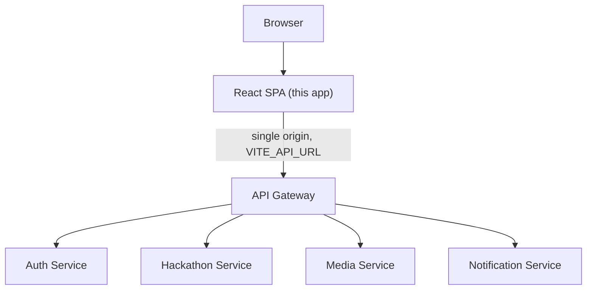
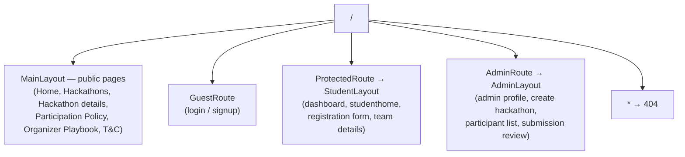
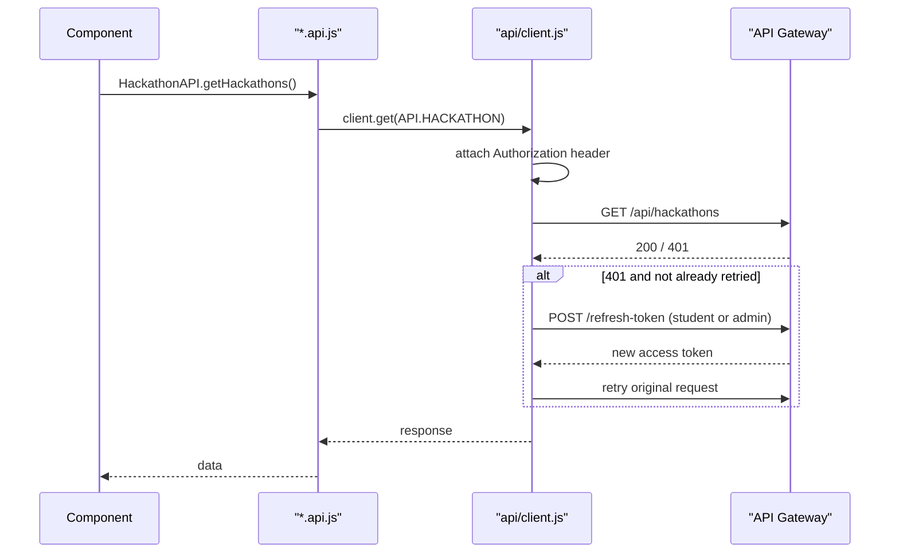
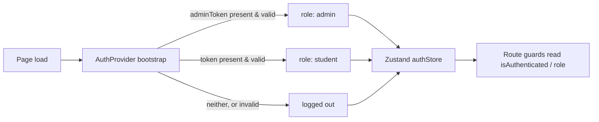

# HackSprint — Frontend

**Stack:** React 19 + Vite + Tailwind CSS
**Scope:** The single-page application served to students, organizers/admins, and judges
**Audience:** Engineers working on this codebase

This document describes the frontend as it is currently implemented — the actual folder structure, routing, data flow, and conventions in this codebase, not an aspirational target.

---

## 1. Overview

The frontend is a single Vite-built React SPA that serves three distinct audiences behind one codebase: **public visitors** (landing page, browsing hackathons), **students** (registering, forming teams, submitting projects), and **admins/judges** (creating hackathons, managing participants, scoring submissions). All of them share the same React tree, router, and API client — the split between audiences happens through route guards and layouts, not separate builds.

The app talks to the backend exclusively through a single API Gateway origin (see [`../../backend/docs/api-gateway.md`](../../backend/docs/api-gateway.md)) — it never addresses an individual microservice directly, in development or production.



---

## 2. Tech Stack

| Concern | Library | Notes |
|---|---|---|
| UI framework | React 19 | Function components + hooks throughout, no class components |
| Build tool | Vite | Dev server + production bundler |
| Styling | Tailwind CSS v4 (`@tailwindcss/vite`) | Utility classes, mostly arbitrary-value (`bg-[#0a0a0a]`) rather than a fixed design-token palette |
| Routing | React Router v6 | Nested routes, layouts via `<Outlet />`, route guards |
| Server state | TanStack Query | Used for read-heavy, cacheable data (e.g. hackathon listings) — see [`hooks/useHackathons.js`](src/hooks/useHackathons.js) |
| Client state | Zustand | One store — [`store/authStore.js`](src/store/authStore.js) — holds the current user/role/auth status |
| HTTP client | Axios | One shared instance, see Section 5 |
| Rich text | Tiptap | Used in [`components/RichTextEditor.jsx`](src/components/RichTextEditor.jsx) for admin-authored content |
| Animation | Framer Motion | Scroll/entrance animations on marketing-style pages |
| Auth (OAuth) | `@react-oauth/google` | Both student and admin Google login flows |
| Icons | `lucide-react` (primary), `react-icons` (secondary) | Most newer pages use lucide-react |
| Toasts | `react-hot-toast` | App-wide notification toasts |
| Misc | `xlsx` (participant export), `dompurify` (sanitizing rendered HTML), `jwt-decode` | Feature-specific, used in a handful of files each |

**No real-time/WebSocket feature exists.** Notifications are fetched over regular HTTP (see [`api/notification.api.js`](src/api/notification.api.js)). An unused `socket.io-client` dependency was removed from `package.json` for exactly this reason — it had zero imports anywhere in `src/` and was dragging in a vulnerable transitive `ws` version for no benefit. If a live-socket feature is ever added, it starts clean from here.

**PWA scaffolding:** [`main.jsx`](src/main.jsx) registers `public/service-worker.js`, a minimal cache-first service worker (caches `/`, `/index.html`, `/manifest.json`). This is basic install-ability, not an offline-first architecture — there's no cache-invalidation strategy or background sync.

---

## 3. Folder Structure

```
src/
  api/            One file per backend resource, plus a shared Axios client
  components/     Reusable UI shared across multiple pages
    auth/         Google OAuth buttons (student + admin variants)
    Chat/         Discussion-thread chat UI
  hackathon/      Feature folder for the public hackathon-detail page
  hooks/          Shared React hooks (auth, data-fetching)
  layouts/        Route-level layout shells (Navbar + Outlet + Footer)
  pages/          Routed page components
    Admin/        Admin/judge-only pages
    Student/      Student-only pages
    Styles/       Page-level stylesheets for larger, standalone pages
  providers/      App-wide context providers (auth bootstrap)
  routes/         The router tree + route-guard components
  store/          Zustand stores
  utils/          Small, stateless helper functions
```

**Why `hackathon/` exists outside `pages/`:** [`pages/Hackathon.jsx`](src/pages/Hackathon.jsx) (the public hackathon-detail page) is composed from ~8 sub-components (hero, sidebar, content tabs, gallery, upvote, social share). Rather than inline all of that into one file or bury it inside `pages/`, those pieces live together in `hackathon/` as a self-contained feature folder. `RegistrationForm.jsx` and `SubmissionForm.jsx` live here too even though they're routed directly (`/hackathon/RegistrationForm/:slug`) — they're tightly coupled to this feature and reused by `Hero-section`'s flow, so keeping them alongside their siblings mattered more than strict "routed things go in `pages/`" purity.

**Why `components/auth/` exists:** the student and admin Google-login buttons are near-identical (same OAuth flow, different API endpoint and redirect target) and are each reused by two sibling pages (`Login.jsx`/`Signup.jsx` for students, `AdminLogin.jsx`/`AdminSignup.jsx` for admins). Grouping them together makes that duplication visible instead of hiding one copy inside `pages/Student/` and the other inside `components/Admin/`.

**CSS convention:** most components co-locate their stylesheet directly next to the component (`Navbar.jsx` + `Navbar.css`, `AdminProfile.jsx` + `AdminProfile.css`). `pages/Styles/` is the exception, reserved for a handful of large, page-level stylesheets (`Home.css`, `Dashboard.css`, `AllHackathons.css`) that define a whole page's visual system rather than one component's — the split is by size/scope, not an inconsistency to "fix" further.

---

## 4. Routing

All routes are declared in one place: [`routes/AppRoute.jsx`](src/routes/AppRoute.jsx). There's no file-based routing — every route is an explicit `<Route>` entry.

### 4.1 Access model

Three route guards gate access, each a thin wrapper reading auth state from the Zustand store via [`hooks/useAuth.js`](src/hooks/useAuth.js):

| Guard | Behavior |
|---|---|
| [`GuestRoute`](src/routes/GuestRoute.jsx) | Only reachable when **not** logged in (login/signup pages) — redirects to `/dashboard` otherwise |
| [`ProtectedRoute`](src/routes/ProtectedRoute.jsx) | Requires any authenticated session — redirects to `/account/login` otherwise |
| [`AdminRoute`](src/routes/AdminRoute.jsx) | Requires an authenticated session **with** `role === "admin"` — redirects to `/adminlogin` otherwise |

Three layouts wrap their route subtree with a shared `Navbar` + `Footer` shell via `<Outlet />`: `MainLayout` (public pages), `StudentLayout`, and `AdminLayout` (passes `variant="admin"` to `Navbar` for a different nav).



### 4.2 Route table

| Path | Guard | Component |
|---|---|---|
| `/` | — | `Home` |
| `/hackathons` | — | `AllHackathons` |
| `/hackathon/:slug` | — | `Hackathon` (details page) |
| `/participation-policies` | — | `Participation` |
| `/organizer-ruleBook` | — | `Organiser` |
| `/terms-and-condition` | — | `TermsCond` (unlinked from nav, still reachable directly) |
| `/adminhome` | — | `Adminhome` (marketing page for organizers) |
| `/u/:userName` | — | `PublicProfile` |
| `/account/login`, `/account/signup` | GuestRoute | `Login`, `Signup` |
| `/account/forgot-password`, `/account/reset-password` | — | `forgotPassword`, `ResetPassword` |
| `/studenthome`, `/dashboard` | ProtectedRoute | `Studenthome`, `Dashboard` |
| `/hackathon/RegistrationForm/:slug` | ProtectedRoute | `RegistrationForm` |
| `/hackathon/:slug/team/:teamId` | ProtectedRoute | `TeamDetails` |
| `/adminlogin`, `/admin/signup` | — | `AdminLogin`, `AdminSignup` |
| `/admin`, `/createHackathon` | AdminRoute | `AdminProfile`, `CreateHackathonPage` |
| `/admin/:slug/usersubmissions` | AdminRoute | `UserList` (participants/teams for a hackathon) |
| `/admin/hackathon/:hackathonId/submission/:entityType/:entityId` | AdminRoute | `AdminSubmissionDetail` |
| `*` | — | `NotFound` |

Note the intentional asymmetry: `/adminlogin` and `/admin/signup` are **not** wrapped in `GuestRoute` the way student login/signup are — an already-logged-in admin can still reach the admin login page directly. That's existing behavior, not an oversight to fix casually.

---

## 5. API Layer

Every backend call goes through one shared Axios instance: [`api/client.js`](src/api/client.js). Nothing in `src/` should construct its own `axios.create()` or call `fetch()` against the backend directly — grep for `axios.create` before adding a new one.



**Base URL.** `client.js` reads `import.meta.env.VITE_API_URL` — set per-environment (see `.env.example`), never hardcoded. Vite inlines this at *build* time, so changing it requires a rebuild, not just a redeploy.

**Endpoint constants.** [`api/endpoints.js`](src/api/endpoints.js) centralizes every backend path prefix (`API.AUTH`, `API.HACKATHON`, `API.MEDIA`, …) as a relative string. Every `*.api.js` file composes full paths from these constants — no file hardcodes a full URL or a raw path string.

**Dual sessions, one tab.** A single browser tab can hold both a student session (`token` in `localStorage`) and an admin session (`adminToken`) simultaneously. The request interceptor picks which token to attach based on `config.adminRequest` or whether the URL contains `/admin`. The response interceptor's 401→refresh logic tracks in-flight refreshes **separately per surface** (`refreshState.student` / `refreshState.admin`), so a student token refresh never blocks or gets blocked by an admin token refresh happening in the same tab.

**One file per resource.** `auth.api.js`, `admin-auth.api.js`, `hackathon.api.js`, `registration.api.js`, `team.api.js`, `submission.api.js`, `voting.api.js`, `discussion.api.js`, `admin.api.js`, `judge.api.js`, `media.api.js`, `notification.api.js`, `profile.api.js` — each wraps `client` calls for one backend resource and is re-exported from [`api/index.js`](src/api/index.js) for convenient importing.

---

## 6. State Management

Two different tools are used deliberately for two different kinds of state — this is not redundancy:

- **Zustand (`store/authStore.js`)** — client-only state: who is logged in, as what role, and whether the initial auth check has finished. Read through [`hooks/useAuth.js`](src/hooks/useAuth.js), never by importing the store directly in a component.
- **TanStack Query (`hooks/useHackathons.js`)** — server state: data that actually lives in the backend (hackathon listings). Query handles caching, refetching, and loading/error state for anything fetched from the API — plain `useState` + `useEffect` fetching is the older pattern still present in some pages (e.g. `Dashboard.jsx`), not the one to copy for new data-fetching code.

**Auth bootstrap.** On every full page load, [`providers/AuthProvider.jsx`](src/providers/AuthProvider.jsx) runs once: it checks `localStorage` for an `adminToken` first, then a student `token`, calls the matching profile endpoint to validate it, and populates the Zustand store accordingly — this is what `ProtectedRoute`/`AdminRoute`/`GuestRoute` are reading `loading`/`isAuthenticated` from before they redirect.



---

## 7. Environment Variables

See [`.env.example`](.env.example). The only required variable is:

```
VITE_API_URL=http://localhost:5000       # dev
VITE_API_URL=https://rahul1901.prometeo.in  # prod
```

Set in Vercel's project dashboard for production (the frontend deploys there independently of the backend's EC2/Docker pipeline — see `../../backend/docs/observability.md` for that side). Google OAuth client IDs are also read from env vars per `AdminLogin`/`Login` usage of `import.meta.env.VITE_GOOGLE_CLIENT_ID`.

---

## 8. Local Development

```bash
npm install
npm run dev       # Vite dev server
npm run build     # production build (also what CI/Vercel runs)
npm run preview   # serve the production build locally
npm run lint      # ESLint across src/
```

**Docker.** The included `Dockerfile` is a multi-stage build: `npm ci` + `vite build` in a `node:20-alpine` builder stage, then the static `dist/` output served by `nginx:alpine`. `VITE_API_URL` must be passed as a build arg (see `.dockerignore` — `.env` is excluded from the build context, so it can't be baked in any other way):

```bash
docker build --build-arg VITE_API_URL=https://rahul1901.prometeo.in -t hacksprint-frontend .
```

The nginx stage uses a custom [`nginx.conf`](nginx.conf), not the stock image default — this matters because it's a client-side-routed SPA. Without `try_files $uri $uri/ /index.html;`, directly loading or refreshing any route other than `/` (e.g. `/dashboard`, `/hackathon/some-slug`) would 404, since no such file exists on disk. This config also enables gzip and long-cache headers for hashed `dist/assets/*` files, and explicitly disables caching on `service-worker.js`.

---

## 9. Conventions Worth Knowing Before Contributing

- **Never** construct a second Axios instance or call the backend outside `api/client.js` — this codebase already had one dead duplicate client removed for exactly this reason.
- **Never** hardcode a service name, `localhost`, or an EC2 IP as an API base URL — always `VITE_API_URL` through the gateway.
- New backend-path constants go in `api/endpoints.js`, not inline in a component.
- File names for components are PascalCase (`HeroSection.jsx`, not `Hero-section.jsx`) — a handful of older kebab-case files were renamed to match; keep new files consistent.
- Prefer TanStack Query for new data-fetching over ad hoc `useState`/`useEffect` fetch logic, even though older pages still do it the manual way.
- This project's ESLint config flags destructured render-prop parameters like `{ icon: Icon }` as unused vars — that's a known false positive across many files here, not a real bug to "fix" by renaming things.
